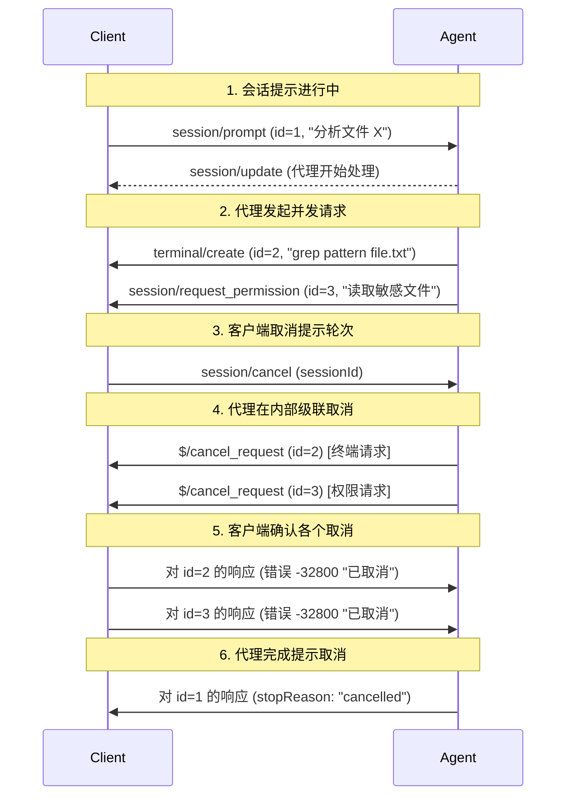

ACP 使用 JSON-RPC 2.0 进行请求和响应。

JSON-RPC 规范没有定义任何标准的请求取消机制，而是将其留给实现决定。

## `$/cancel_request` 通知

为了提供一致的取消方法，ACP 定义了一个 `$/cancel_request` 通知，可用于取消请求。

取消将保持可选，因为它可能无法在所有客户端或服务器中实现。例如，如果实现使用单线程同步编程语言，那么它对 `$/cancel_request` 通知的反应能力就很有限。

当支持该功能的实现收到 `$/cancel_request` 通知时，该实现：

- **必须**取消相应的请求活动以及与此请求相关的所有嵌套活动
- **可以**在响应之前完成发送任何待处理的通知
- **必须**为原始请求发送以下响应之一：
  - 包含适当数据的有效响应（如部分结果或取消标记）
  - 带有代码 [`-32800` (Request Cancelled)](./schema#errorcode) 的错误响应

调用方**可以**通过等待远程端的响应来实现优雅的取消处理。

取消**可以**在协议内按功能显式完成，以覆盖特定场景（例如，[提示轮次](./prompt-turn#cancellation)的取消）

## 内部取消

请求也可以由执行方在内部取消，而无需接收 `$/cancel_request`：

- **客户端示例**：用户关闭 IDE、切换到不同项目、文件变得不可用
- **代理示例**：LLM 上下文限制达到、内部超时、资源约束

当发生内部取消时，执行方**必须**：

- 发送与收到 `$/cancel_request` 时相同的 `-32800` (Cancelled) 错误响应
- 无论取消来源如何，确保行为一致

## 示例：级联取消流程

