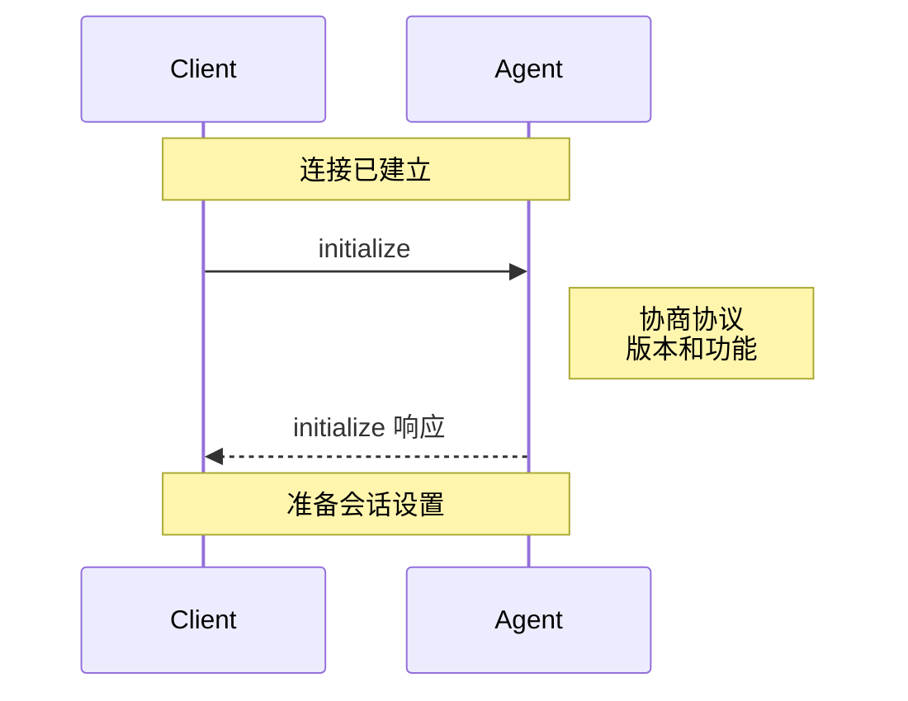

{/* todo! link to all concepts */}

初始化阶段允许[客户端](./overview#client)和[代理](./overview#agent)协商协议版本、功能和身份验证方法。

<br />



<br />

在创建会话之前，客户端**必须**通过调用 `initialize` 方法来初始化连接，并提供：

- 支持的最新[协议版本](#protocol-version)
- 支持的[功能](#client-capabilities)

它们**应该**还向代理提供名称和版本。

```json
{
  "jsonrpc": "2.0",
  "id": 0,
  "method": "initialize",
  "params": {
    "protocolVersion": 1,
    "clientCapabilities": {
      "fs": {
        "readTextFile": true,
        "writeTextFile": true
      },
      "terminal": true
    },
    "clientInfo": {
      "name": "my-client",
      "title": "My Client",
      "version": "1.0.0"
    }
  }
}
```

代理**必须**用选定的[协议版本](#protocol-version)和它支持的[功能](#agent-capabilities)进行响应。它**应该**也向客户端提供名称和版本：

```json
{
  "jsonrpc": "2.0",
  "id": 0,
  "result": {
    "protocolVersion": 1,
    "agentCapabilities": {
      "loadSession": true,
      "promptCapabilities": {
        "image": true,
        "audio": true,
        "embeddedContext": true
      },
      "mcp": {
        "http": true,
        "sse": true
      }
    },
    "agentInfo": {
      "name": "my-agent",
      "title": "My Agent",
      "version": "1.0.0"
    },
    "authMethods": []
  }
}
```

## 协议版本

出现在 `initialize` 请求和响应中的协议版本是一个标识**主要**协议版本的单个整数。此版本仅在引入重大变更时才会递增。

客户端和代理**必须**就协议版本达成一致，并根据其规范进行操作。

请参阅[功能](#capabilities)了解如何引入非破坏性特性。

### 版本协商

`initialize` 请求**必须**包含客户端支持的最新协议版本。

如果代理支持请求的版本，它**必须**用相同的版本进行响应。否则，代理**必须**用它支持的最新版本进行响应。

如果客户端不支持代理在 `initialize` 响应中指定的版本，客户端**应该**关闭连接并通知用户。

## 功能

功能描述了客户端和代理支持的特性。

`initialize` 请求中包含的所有功能都是**可选的**。客户端和代理**应该**支持其对等方功能的所有可能组合。

引入新功能不被视为破坏性变更。因此，客户端和代理**必须**将 `initialize` 请求中省略的所有功能视为**不支持**。 

功能是高级别的，不附加到特定的基础协议概念。

功能可以指定协议方法、通知的可用性，或其参数的子集。它们还可以信号代理或客户端实现的行为。

实现还可以使用 `_meta` 字段[宣告自定义功能](./extensibility#advertising-custom-capabilities)来指示对协议扩展的支持。

### 客户端功能

客户端**应该**指定是否支持以下功能：

#### 文件系统

<ParamField path="readTextFile" type="boolean">
  `fs/read_text_file` 方法可用。
</ParamField>

<ParamField path="writeTextFile" type="boolean">
  `fs/write_text_file` 方法可用。
</ParamField>

<Card icon="file" horizontal href="./file-system">
  了解更多关于文件系统方法
</Card>

#### 终端

<ParamField path="terminal" type="boolean">
  所有 `terminal/*` 方法都可用，允许代理执行和管理 shell 命令。
</ParamField>

<Card icon="terminal" horizontal href="./terminals">
  了解更多关于终端
</Card>

### 代理功能

代理**应该**指定是否支持以下功能：

<ResponseField name="loadSession" type="boolean" post={["default: false"]}>
  [`session/load`](./session-setup#loading-sessions) 方法可用。
</ResponseField>

<ResponseField name="promptCapabilities" type="PromptCapabilities Object">
  指示 `session/prompt` 请求中可能包含的不同类型的[内容](./content)的对象。
</ResponseField>

#### 提示功能

作为基线，所有代理**必须**在 `session/prompt` 请求中支持 `ContentBlock::Text` 和 `ContentBlock::ResourceLink`。

可选地，它们**可以**通过指定以下功能来支持更丰富的[内容](./content)类型：

<ResponseField name="image" type="boolean" post={["default: false"]}>
  提示可以包含 `ContentBlock::Image`
</ResponseField>

<ResponseField name="audio" type="boolean" post={["default: false"]}>
  提示可以包含 `ContentBlock::Audio`
</ResponseField>

<ResponseField name="embeddedContext" type="boolean" post={["default: false"]}>
  提示可以包含 `ContentBlock::Resource`
</ResponseField>

#### MCP 功能

<ResponseField name="http" type="boolean" post={["default: false"]}>
  代理支持通过 HTTP 连接到 MCP 服务器。
</ResponseField>

<ResponseField name="sse" type="boolean" post={["default: false"]}>
  代理支持通过 SSE 连接到 MCP 服务器。

注意：此传输已被 MCP 规范弃用。

</ResponseField>

#### 会话功能

作为基线，所有代理**必须**支持 `session/new`、`session/prompt`、`session/cancel` 和 `session/update`。

可选地，它们**可以**通过指定附加功能来支持其他会话方法和通知。

<Note>
  `session/load` 仍由顶级 `load_session` 功能处理。
  这将在未来版本的协议中统一。
</Note>

## 实现信息

客户端和代理**应该**分别在 `clientInfo` 和 `agentInfo` 字段中提供关于其实现的信息。两者都包含以下三个字段：

<ParamField path="name" type="string">
  用于编程或逻辑使用，但如果 title 不存在，可用作显示名称回退。
</ParamField>

<ParamField path="title" type="string">
  用于 UI 和最终用户场景 — 优化为易于阅读和理解的格式。如果未提供，名称应用于显示。
</ParamField>

<ParamField path="version" type="string">
  实现的版本。可以显示给用户或用于调试或指标目的。
</ParamField>

<Info>
  注意：在未来版本的协议中，此信息将是必需的。
</Info>

---

连接初始化完成后，您就可以[创建会话](./session-setup)并开始与代理对话了。
