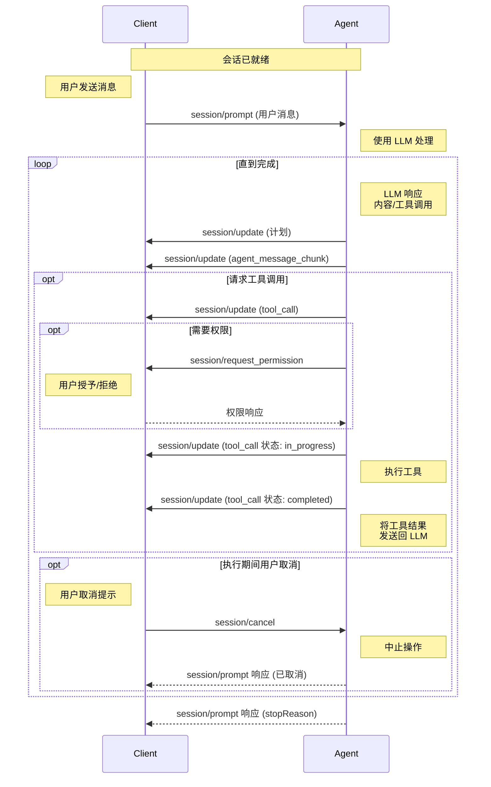

提示轮次代表[客户端](./overview#client)和[代理](./overview#agent)之间的完整交互周期，从用户消息开始，持续到代理完成其响应。这可能涉及与语言模型的多次交换和工具调用。

在发送提示之前，客户端**必须**首先完成[初始化](./initialization)阶段和[会话设置](./session-setup)。

## 提示轮次生命周期

提示轮次遵循结构化流程，支持用户、代理和任何连接工具之间的丰富交互。

<br />



### 1. 用户消息

当客户端发送 `session/prompt` 时，轮次开始：

```json
{
  "jsonrpc": "2.0",
  "id": 2,
  "method": "session/prompt",
  "params": {
    "sessionId": "sess_abc123def456",
    "prompt": [
      {
        "type": "text",
        "text": "你能分析这段代码中的潜在问题吗？"
      },
      {
        "type": "resource",
        "resource": {
          "uri": "file:///home/user/project/main.py",
          "mimeType": "text/x-python",
          "text": "def process_data(items):\n    for item in items:\n        print(item)"
        }
      }
    ]
  }
}
```

<ParamField path="sessionId" type="SessionId">
    发送此消息的会话的[ID](./session-setup#session-id)。
</ParamField>
<ParamField path="prompt" type="ContentBlock[]">
    用户消息的内容，例如文本、图像、文件等。

    客户端**必须**根据[初始化](./initialization)期间建立的[提示功能](./initialization#prompt-capabilities)限制内容类型。

    <Card icon="comments" horizontal href="./content">
      了解更多关于内容的信息
    </Card>

</ParamField>

### 2. 代理处理

接收到提示请求后，代理处理用户消息并将其发送到语言模型，语言模型**可以**用文本内容、工具调用或两者响应。

### 3. 代理报告输出

代理通过 `session/update` 通知向客户端报告模型的输出。这可能包括代理完成任务的计划：

```json expandable
{
  "jsonrpc": "2.0",
  "method": "session/update",
  "params": {
    "sessionId": "sess_abc123def456",
    "update": {
      "sessionUpdate": "plan",
      "entries": [
        {
          "content": "检查语法错误",
          "priority": "high",
          "status": "pending"
        },
        {
          "content": "识别潜在的类型问题",
          "priority": "medium",
          "status": "pending"
        },
        {
          "content": "审查错误处理模式",
          "priority": "medium",
          "status": "pending"
        },
        {
          "content": "建议改进",
          "priority": "low",
          "status": "pending"
        }
      ]
    }
  }
}
```

<Card icon="lightbulb" horizontal href="./agent-plan">
  了解更多关于代理计划的信息
</Card>

然后代理报告模型的文本响应：

```json
{
  "jsonrpc": "2.0",
  "method": "session/update",
  "params": {
    "sessionId": "sess_abc123def456",
    "update": {
      "sessionUpdate": "agent_message_chunk",
      "content": {
        "type": "text",
        "text": "我将分析你的代码中的潜在问题。让我检查它..."
      }
    }
  }
}
```

如果模型请求了工具调用，这些也会立即报告：

```json
{
  "jsonrpc": "2.0",
  "method": "session/update",
  "params": {
    "sessionId": "sess_abc123def456",
    "update": {
      "sessionUpdate": "tool_call",
      "toolCallId": "call_001",
      "title": "分析 Python 代码",
      "kind": "other",
      "status": "pending"
    }
  }
}
```

### 4. 检查完成

如果没有待处理的工具调用，轮次结束，代理**必须**用 `StopReason` 响应原始的 `session/prompt` 请求：

```json
{
  "jsonrpc": "2.0",
  "id": 2,
  "result": {
    "stopReason": "end_turn"
  }
}
```

代理**可以**在任何时候通过返回相应的 [`StopReason`](#stop-reasons) 停止轮次。

### 5. 工具调用和状态报告

在继续执行之前，代理**可以**通过 `session/request_permission` 方法请求客户端的权限。

一旦授予权限（如果需要），代理**应该**调用工具并报告状态更新，将工具标记为 `in_progress`：

```json
{
  "jsonrpc": "2.0",
  "method": "session/update",
  "params": {
    "sessionId": "sess_abc123def456",
    "update": {
      "sessionUpdate": "tool_call_update",
      "toolCallId": "call_001",
      "status": "in_progress"
    }
  }
}
```

随着工具运行，代理**可以**发送额外的更新，提供关于工具执行进度的实时反馈。

虽然工具在代理上执行，但它们**可以**利用客户端功能，如文件系统 (`fs`) 方法，访问客户端环境中的资源。

当工具完成时，代理发送另一个更新，包含最终状态和任何内容：

```json
{
  "jsonrpc": "2.0",
  "method": "session/update",
  "params": {
    "sessionId": "sess_abc123def456",
    "update": {
      "sessionUpdate": "tool_call_update",
      "toolCallId": "call_001",
      "status": "completed",
      "content": [
        {
          "type": "content",
          "content": {
            "type": "text",
            "text": "分析完成：\n- 未发现语法错误\n- 考虑添加类型提示以提高清晰度\n- 该函数可以从空列表的错误处理中受益"
          }
        }
      ]
    }
  }
}
```

<Card icon="hammer" horizontal href="./tool-calls">
  了解更多关于工具调用的信息
</Card>

### 6. 继续对话

代理将工具结果发送回语言模型作为另一个请求。

循环返回到[步骤 2](#2-agent-processing)，持续进行，直到语言模型完成其响应而不请求额外的工具调用，或轮次被代理停止或被客户端取消。

## 停止原因

当代理停止轮次时，必须指定相应的 `StopReason`：

<ResponseField name="end_turn">
  语言模型完成响应而不请求更多工具
</ResponseField>

<ResponseField name="max_tokens">
  达到最大令牌限制
</ResponseField>

<ResponseField name="max_turn_requests">
  超出单个轮次中模型请求的最大数量
</ResponseField>

<ResponseField name="refusal">代理拒绝继续</ResponseField>

<ResponseField name="cancelled">客户端取消轮次</ResponseField>

## 取消

客户端**可以**在任何时候通过发送 `session/cancel` 通知取消正在进行的提示轮次：

```json
{
  "jsonrpc": "2.0",
  "method": "session/cancel",
  "params": {
    "sessionId": "sess_abc123def456"
  }
}
```

客户端在发送 `session/cancel` 通知后，**应该**抢先将所有与当前轮次相关的未完成的工具调用标记为 `cancelled`。

客户端**必须**用 `cancelled` 结果响应所有待处理的 `session/request_permission` 请求。

当代理收到此通知时，它**应该**尽快停止所有语言模型请求和所有工具调用。

在所有正在进行的操作成功中止且待处理的更新已发送后，代理**必须**用 `cancelled` [停止原因](#stop-reasons)响应原始的 `session/prompt` 请求。

<Warning>
  API 客户端库和工具在操作中中止时通常会抛出异常，这可能会作为错误响应传播到 `session/prompt`。

客户端通常会向用户显示来自代理的无法识别的错误，这对于取消来说是不希望的，因为它们不被视为错误。

代理**必须**捕获这些错误并返回语义上有意义的 `cancelled` 停止原因，以便客户端可以可靠地确认取消。

</Warning>

代理在收到 `session/cancel` 通知后**可以**发送带有内容或工具调用更新的 `session/update` 通知，但它**必须**确保在响应 `session/prompt` 请求之前这样做。

客户端在发送 `session/cancel` 后**应该**仍然接受收到的工具调用更新。

---

一旦提示轮次完成，客户端可以发送另一个 `session/prompt` 以继续对话，建立在先前轮次中建立的上下文之上。
