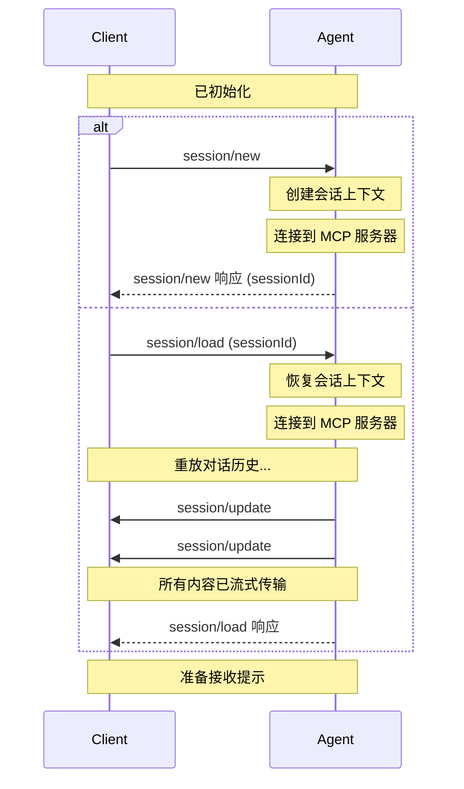

会话代表[客户端](./overview#client)和[代理](./overview#agent)之间的特定对话或线程。每个会话维护自己的上下文、对话历史记录和状态，允许与同一代理进行多个独立的交互。

在创建会话之前，客户端**必须**首先完成[初始化](./initialization)阶段以建立协议兼容性和功能。

<br />



<br />

## 创建会话

客户端通过调用 `session/new` 方法创建新会话，并提供：

- 会话的[工作目录](#working-directory)
- 代理应连接的[MCP 服务器](#mcp-servers)列表

```json
{
  "jsonrpc": "2.0",
  "id": 1,
  "method": "session/new",
  "params": {
    "cwd": "/home/user/project",
    "mcpServers": [
      {
        "name": "filesystem",
        "command": "/path/to/mcp-server",
        "args": ["--stdio"],
        "env": []
      }
    ]
  }
}
```

代理**必须**用唯一标识此对话的[会话 ID](#session-id) 进行响应：

```json
{
  "jsonrpc": "2.0",
  "id": 1,
  "result": {
    "sessionId": "sess_abc123def456"
  }
}
```

## 加载会话

支持 `loadSession` 功能的代理允许客户端恢复之前的对话。此功能支持跨重启持久化以及在不同客户端实例之间共享会话。

### 检查支持

在尝试加载会话之前，客户端**必须**通过在 `initialize` 响应中检查 `loadSession` 字段来验证代理是否支持此功能：

```json highlight={7}
{
  "jsonrpc": "2.0",
  "id": 0,
  "result": {
    "protocolVersion": 1,
    "agentCapabilities": {
      "loadSession": true
    }
  }
}
```

如果 `loadSession` 为 `false` 或不存在，则代理不支持加载会话，客户端**不得**尝试调用 `session/load`。

### 加载会话

要加载现有会话，客户端**必须**调用 `session/load` 方法，并提供：

- 要恢复的[会话 ID](#session-id)
- 要连接的[MCP 服务器](#mcp-servers)
- [工作目录](#working-directory)

```json
{
  "jsonrpc": "2.0",
  "id": 1,
  "method": "session/load",
  "params": {
    "sessionId": "sess_789xyz",
    "cwd": "/home/user/project",
    "mcpServers": [
      {
        "name": "filesystem",
        "command": "/path/to/mcp-server",
        "args": ["--mode", "filesystem"],
        "env": []
      }
    ]
  }
}
```

代理**必须**以 `session/update` 通知的形式（如 `session/prompt`）将整个对话重放到客户端。

例如，来自对话历史记录的用户消息：

```json
{
  "jsonrpc": "2.0",
  "method": "session/update",
  "params": {
    "sessionId": "sess_789xyz",
    "update": {
      "sessionUpdate": "user_message_chunk",
      "content": {
        "type": "text",
        "text": "What's the capital of France?"
      }
    }
  }
}
```

后跟代理的响应：

```json
{
  "jsonrpc": "2.0",
  "method": "session/update",
  "params": {
    "sessionId": "sess_789xyz",
    "update": {
      "sessionUpdate": "agent_message_chunk",
      "content": {
        "type": "text",
        "text": "The capital of France is Paris."
      }
    }
  }
}
```

当**所有**对话条目都已流式传输到客户端后，代理**必须**响应原始的 `session/load` 请求。

```json
{
  "jsonrpc": "2.0",
  "id": 1,
  "result": null
}
```

然后客户端可以继续发送提示，就像会话从未中断一样。

## 会话 ID

`session/new` 返回的会话 ID 是会话上下文的唯一标识符。

客户端使用此 ID 来：

- 通过 `session/prompt` 发送提示请求
- 通过 `session/cancel` 取消正在进行的操作
- 通过 `session/load` 加载之前的会话（如果代理支持 `loadSession` 功能）

## 工作目录

`cwd`（当前工作目录）参数为会话建立文件系统上下文。此目录：

- **必须**是绝对路径
- **必须**用于会话，无论代理子进程在何处启动
- **应该**作为文件系统上工具操作的边界

## MCP 服务器

[Model Context Protocol (MCP)](https://modelcontextprotocol.io) 允许代理访问外部工具和数据源。创建会话时，客户端**可以**包含代理应连接的 MCP 服务器的连接详细信息。

MCP 服务器可以使用不同的传输方式连接。所有代理**必须**支持 stdio 传输，而 HTTP 和 SSE 传输是可选功能，可以在初始化期间检查。

虽然规范不要求，但新代理**应该**支持 HTTP 传输，以确保与现代 MCP 服务器的兼容性。

### 传输类型

#### Stdio 传输

所有代理**必须**支持通过 stdio（标准输入/输出）连接到 MCP 服务器。这是默认的传输机制。

<ParamField path="name" type="string" required>
  服务器的人类可读标识符
</ParamField>

<ParamField path="command" type="string" required>
  MCP 服务器可执行文件的绝对路径
</ParamField>

<ParamField path="args" type="array" required>
  传递给服务器的命令行参数
</ParamField>

<ParamField path="env" type="EnvVariable[]">
  启动服务器时要设置的环境变量

  <Expandable title="EnvVariable">
      <ParamField path="name" type="string">
        环境变量的名称。
      </ParamField>
      <ParamField path="value" type="string">
        环境变量的值。
      </ParamField>
  </Expandable>
</ParamField>

Stdio 传输配置示例：

```json
{
  "name": "filesystem",
  "command": "/path/to/mcp-server",
  "args": ["--stdio"],
  "env": [
    {
      "name": "API_KEY",
      "value": "secret123"
    }
  ]
}
```

#### HTTP 传输

当代理支持 `mcpCapabilities.http` 时，客户端可以使用 HTTP 传输指定 MCP 服务器配置。

<ParamField path="type" type="string" required>
  必须是 `"http"` 以指示 HTTP 传输
</ParamField>

<ParamField path="name" type="string" required>
  服务器的人类可读标识符
</ParamField>

<ParamField path="url" type="string" required>
  MCP 服务器的 URL
</ParamField>

<ParamField path="headers" type="HttpHeader[]" required>
  发送到服务器的请求中包含的 HTTP 头

  <Expandable title="HttpHeader">
      <ParamField path="name" type="string">
        HTTP 头的名称。
      </ParamField>
      <ParamField path="value" type="string">
        为 HTTP 头设置的值。
      </ParamField>
  </Expandable>
</ParamField>

HTTP 传输配置示例：

```json
{
  "type": "http",
  "name": "api-server",
  "url": "https://api.example.com/mcp",
  "headers": [
    {
      "name": "Authorization",
      "value": "Bearer token123"
    },
    {
      "name": "Content-Type",
      "value": "application/json"
    }
  ]
}
```

#### SSE 传输

当代理支持 `mcpCapabilities.sse` 时，客户端可以使用 SSE 传输指定 MCP 服务器配置。

<Warning>此传输已被 MCP 规范弃用。</Warning>

<ParamField path="type" type="string" required>
  必须是 `"sse"` 以指示 SSE 传输
</ParamField>

<ParamField path="name" type="string" required>
  服务器的人类可读标识符
</ParamField>

<ParamField path="url" type="string" required>
  SSE 端点的 URL
</ParamField>

<ParamField path="headers" type="HttpHeader[]" required>
  建立 SSE 连接时包含的 HTTP 头

  <Expandable title="HttpHeader">
      <ParamField path="name" type="string">
        HTTP 头的名称。
      </ParamField>
      <ParamField path="value" type="string">
        为 HTTP 头设置的值。
      </ParamField>
  </Expandable>
</ParamField>

SSE 传输配置示例：

```json
{
  "type": "sse",
  "name": "event-stream",
  "url": "https://events.example.com/mcp",
  "headers": [
    {
      "name": "X-API-Key",
      "value": "apikey456"
    }
  ]
}
```

### 检查传输支持

在使用 HTTP 或 SSE 传输之前，客户端**必须**在初始化期间验证代理的功能：

```json highlight={7-10}
{
  "jsonrpc": "2.0",
  "id": 0,
  "result": {
    "protocolVersion": 1,
    "agentCapabilities": {
      "mcpCapabilities": {
        "http": true,
        "sse": true
      }
    }
  }
}
```

如果 `mcpCapabilities.http` 为 `false` 或不存在，则代理不支持 HTTP 传输。
如果 `mcpCapabilities.sse` 为 `false` 或不存在，则代理不支持 SSE 传输。

代理**应该**连接到客户端指定的所有 MCP 服务器。

客户端**可以**使用此能力通过包含自己的 MCP 服务器直接向底层语言模型提供工具。