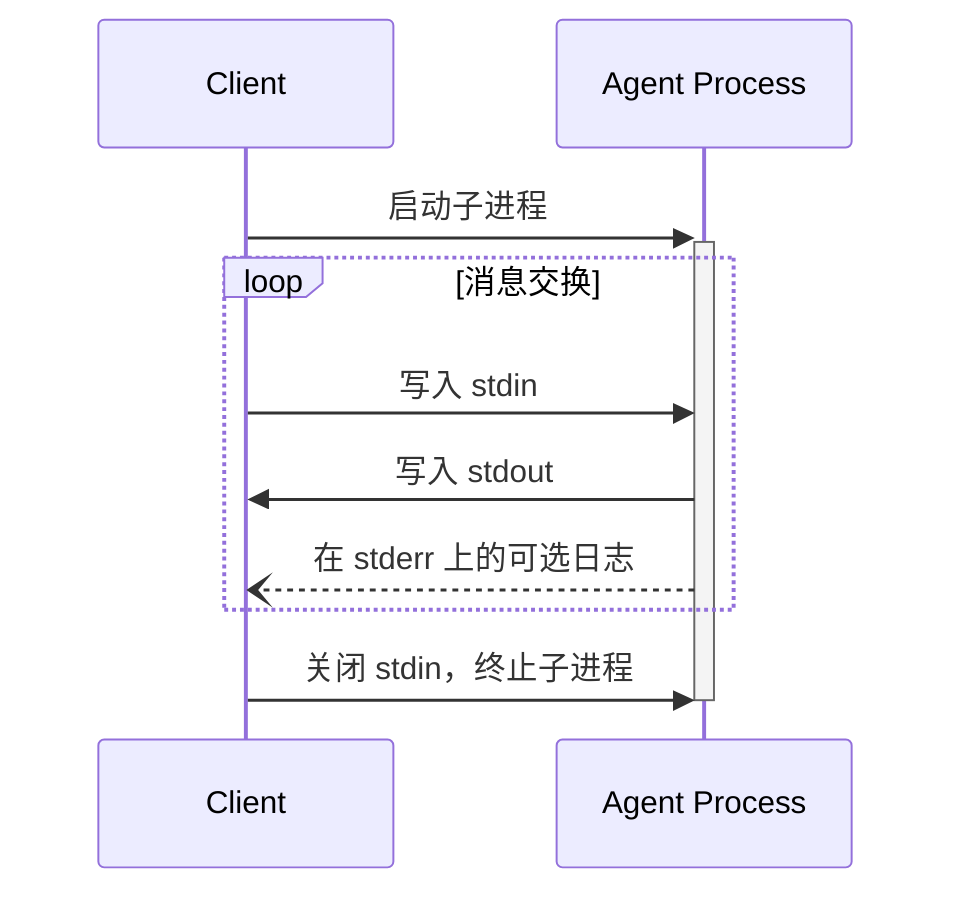

ACP 使用 JSON-RPC 对消息进行编码。JSON-RPC 消息**必须**使用 UTF-8 编码。

协议目前为代理-客户端通信定义了以下传输机制：

1. [stdio](#stdio)，通过标准输入和标准输出进行通信
2. _[Streamable HTTP](#streamable-http)（草案提案进行中）_

代理和客户端**应该**在可能的情况下支持 stdio。

代理和客户端也可以实现[自定义传输方式](#custom-transports)。

## stdio

在 **stdio** 传输中：

- 客户端将代理作为子进程启动。
- 代理从其标准输入（`stdin`）读取 JSON-RPC 消息，并将消息发送到其标准输出（`stdout`）。
- 消息是单独的 JSON-RPC 请求、通知或响应。
- 消息以换行符（`\n`）分隔，**不得**包含嵌入式换行符。
- 代理**可以**将 UTF-8 字符串写入其标准错误（`stderr`）以用于日志记录。客户端**可以**捕获、转发或忽略这些日志。
- 代理**不得**向其 `stdout` 写入任何不是有效 ACP 消息的内容。
- 客户端**不得**向代理的 `stdin` 写入任何不是有效 ACP 消息的内容。

## _Streamable HTTP_

_讨论中，草案提案进行中。_

## 自定义传输方式

代理和客户端**可以**实现额外的自定义传输机制以满足其特定需求。该协议与传输无关，可以在任何支持双向消息交换的通信通道上实现。

选择支持自定义传输的实现者**必须**确保它们保留 ACP 定义的 JSON-RPC 消息格式和生命周期要求。自定义传输**应该**记录其特定的连接建立和消息交换模式，以帮助互操作性。
