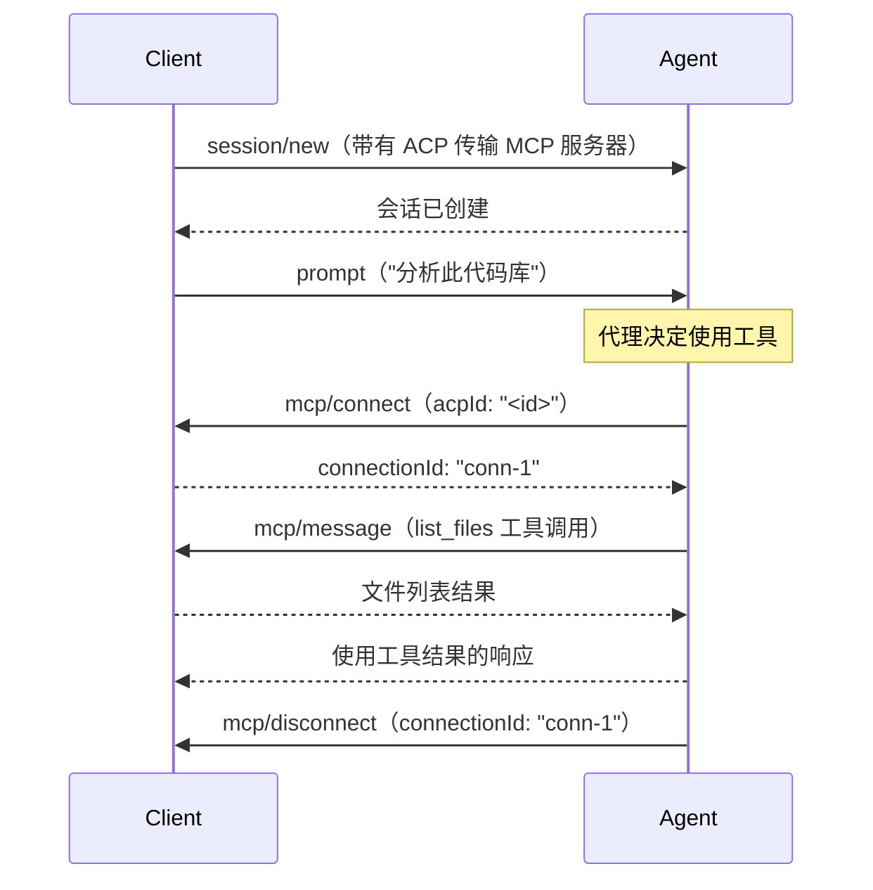
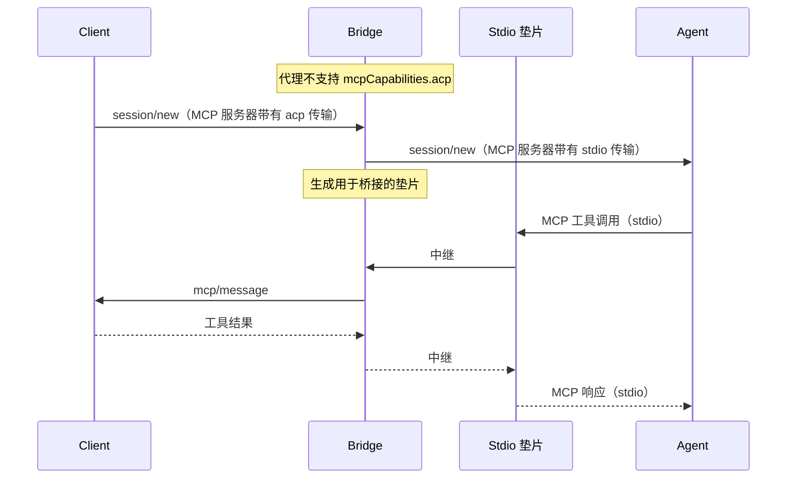

作者：[nikomatsakis](https://github.com/nikomatsakis)

## 电梯演讲

> 您提议进行什么更改？

添加对通过 ACP 通道而不是 stdio 或 HTTP 进行通信的 MCP 服务器的支持。这使任何 ACP 组件都能够通过现有的 ACP 连接提供 MCP 工具和处理回调，而无需生成单独的进程或管理额外的传输。

## 现状

> 今天的事情是如何运作的，这导致了什么问题？我们为什么要改变？

ACP 和 MCP 各自解决与代理交互问题的不同方面。ACP 站在代理"前面"，管理会话、发送提示并接收响应。MCP 站在代理"后面"，提供代理可以用来完成其工作的工具。

许多应用程序会受益于能够同时"在代理前面"和"在代理后面"。例如，这允许客户端创建定制到特定请求的 MCP 工具，并且这些工具位于客户端的地址空间中。

今天结合 ACP 和 MCP 的唯一方法是使用某种"后门"，例如为代理打开 HTTP 端口或提供使用 IPC 通信的二进制文件。这在实现上不方便，但也意味着客户端无法正确抽象和沙盒化，因为与代理的一些通信是通过旁路通道进行的。想象一下尝试托管一个 ACP 组件（客户端、代理或 [代理扩展](./proxy-chains.mdx)）运行在 WASM 沙盒中甚至在另一台机器上：为此，ACP 协议必须涵盖所有相关交互，以便消息能够正确传输。

## 我们提议对此做什么

> 您提议如何改善情况？

我们提议添加 `"acp"` 作为新的 MCP 传输类型。当 ACP 组件（客户端或代理）向会话添加带有 ACP 传输的 MCP 服务器时，该服务器的 tool invocations 会通过 ACP 通道路由回提供它的组件。

这实现了以下模式：

- 一个**客户端**将项目感知工具注入每个会话并直接处理回调
- 一个**[代理扩展](./proxy-chains.mdx)**根据对话状态添加上下文感知工具
- 一个**桥接器**将 ACP 传输 MCP 服务器转换为 stdio，以供不支持原生 ACP 传输的代理使用

### 它是如何工作的

当客户端连接时，代理通过其 `InitializeResponse` 中的 `mcpCapabilities.acp` 广告 MCP-over-ACP 支持。如果支持，客户端可以在 `session/new` 请求中添加带有 `"transport": "acp"` 和标识服务器的 `id` 的 MCP 服务器：

```json
{
  "tools": {
    "mcpServers": {
      "project-tools": {
        "transport": "acp",
        "id": "550e8400-e29b-41d4-a716-446655440000"
      }
    }
  }
}
```

`id` 由提供 MCP 服务器的组件生成。

当代理连接到 MCP 服务器时，会发送一条带有 MCP 服务器 `id` 的 `mcp/connect` 消息。这会返回一个新鲜的 `connectionId`。然后使用 `mcp/message` 请求来回发送 MCP 消息。最后，`mcp/disconnect` 表示连接正在关闭。

### 桥接和兼容性

现有代理不支持 MCP 服务器的 ACP 传输。为了弥合这一差距，包装器组件可以在 ACP 传输 MCP 服务器和代理已经支持的 stdio/HTTP 传输之间进行转换。包装器生成代理正常连接的垫片进程或 HTTP 服务器，然后在中继 ACP 通道之间的消息。

我们已经在 [Proxy Chains RFD](./proxy-chains) 中描述的 conductor 中实现了这个桥接。conductor 始终向其客户端广告 `mcpCapabilities.acp: true`，无论下游代理是否支持原生 ACP 传输，都会透明地处理翻译。

### 消息流示例



## 美好的未来

> 一旦这个功能存在，事情将如何发展？

### 无缝工具注入

组件可以提供工具而无需任何进程管理。Rust 开发环境可以注入 cargo 感知工具，云 IDE 可以注入部署工具，安全扫描器可以注入漏洞检查——所有这些都通过它们已经在使用的相同 ACP 连接。

### 基于 WebAssembly 的工具

在沙盒环境（如 WASM）中运行的组件可以提供 MCP 工具，而无需文件系统或进程生成能力。ACP 通道是它们唯一的接口，这已经足够了。

### 透明桥接

对于不原生支持 ACP 传输的代理，中间人可以透明地桥接：接受来自客户端的 MCP-over-ACP 并生成代理可以正常使用的基于 stdio 或 HTTP 的 MCP 服务器。这在允许生态系统逐步采用 ACP 传输的同时提供向后兼容性。

## 实施细节和计划

> 告诉我更多关于您的实施。您的详细实施计划是什么？

### 能力广告

代理通过其 [`mcpCapabilities`](/protocol/schema#mcpcapabilities) 字段在其 `InitializeResponse` 中广告 MCP-over-ACP 支持。我们提议在这个现有结构中添加一个 `acp` 字段：

```json
{
  "capabilities": {
    "mcpCapabilities": {
      "http": false,
      "sse": false,
      "acp": true
    }
  }
}
```

当 `mcpCapabilities.acp` 为 `true` 时，代理可以原生处理使用 `"transport": "acp"` 声明的 MCP 服务器——它将通过 ACP 通道发送 `mcp/connect`、`mcp/message` 和 `mcp/disconnect` 消息。

客户端不需要广告任何内容——它们只需检查代理的能力来确定是否需要桥接。

**桥接中间人**：提供桥接的中间人可以向其客户端呈现 `mcpCapabilities.acp: true`，无论下游代理是否支持它，都会透明地处理桥接（请参阅下面的[桥接](#桥接以支持没有原生支持的代理)）。

### MCP 传输模式扩展

我们将 MCP JSON 模式扩展为包括 ACP 作为传输选项：

```json
{
  "type": "object",
  "properties": {
    "transport": {
      "type": "string",
      "enum": ["stdio", "http", "acp"]
    }
  },
  "allOf": [
    {
      "if": { "properties": { "transport": { "const": "acp" } } },
      "then": {
        "properties": {
          "id": {
            "type": "string"
          }
        },
        "required": ["id"]
      }
    }
  ]
}
```

### 消息参考

**连接生命周期：**

```json
// 建立 MCP 连接
{
  "method": "mcp/connect",
  "params": {
    "acpId": "550e8400-e29b-41d4-a716-446655440000",
    "meta": { ... }
  }
}
// 响应：
{
  "connectionId": "conn-123",
  "meta": { ... }
}

// 关闭 MCP 连接
{
  "method": "mcp/disconnect",
  "params": {
    "connectionId": "conn-123",
    "meta": { ... }
  }
}
```

**MCP 消息交换：**

```json
// 发送 MCP 消息（双向——代理→客户端或客户端→代理）
{
  "method": "mcp/message",
  "params": {
    "connectionId": "conn-123",
    "method": "<MCP_METHOD>",
    "params": { ... },
    "meta": { ... }
  }
}
```

内部 MCP 消息字段（`method`、`params`）被展平到 params 对象中。包装的消息是请求还是通知由外部 JSON-RPC 信封中 `id` 字段的存在决定，遵循 JSON-RPC 约定。

### 按 ID 路由

`mcp/connect` 中的 `acpId` 与组件在 `session/new` 中声明 MCP 服务器时提供的 `id` 匹配。接收方使用此 `id` 将消息路由到正确的处理程序。

当一个组件在单个会话中提供多个 MCP 服务器时，每个服务器获得一个唯一的 `id`，从而实现正确的消息路由。

### 连接复用

支持连接到同一个 MCP 服务器的多个连接——每个 `mcp/connect` 返回一个唯一的 `connectionId`。这允许代理打开到同一个工具服务器的多个并发连接的场景。

### 桥接以支持没有原生支持的代理

并非所有代理都会原生支持 MCP-over-ACP。为了保持兼容性，可以编写一个桥接，将 ACP 传输 MCP 服务器转换为代理确实支持的传输。

**桥接方法：**

- **Stdio 垫片**：生成一个代理通过 stdio 连接的小垫片进程。垫片将 MCP 消息中继到/from ACP 通道。这是兼容的方法，因为所有支持 MCP 的代理都支持 stdio。

- **HTTP 桥接**：运行一个代理连接的本地 HTTP 服务器。MCP 消息被中继到/from ACP 通道。这适用于更喜欢 HTTP 传输的代理。

**桥接如何工作：**

当客户端提供带有 `"transport": "acp"` 的 MCP 服务器，而代理没有广告 `mcpCapabilities.acp: true` 时，桥接可以：

1. 重写 `session/new` 中的 MCP 服务器声明以使用 stdio 或 HTTP 传输
2. 生成适当的垫片进程或 HTTP 服务器
3. 在垫片和 ACP 通道之间中继消息

从代理的角度来看，它在和正常的 stdio/HTTP MCP 服务器通信。从客户端的角度来看，它在处理 MCP-over-ACP 消息。桥接透明地处理翻译。



这个桥接的初步实现存在于 `sacp-conductor` crate 中，这是提议的 [ACP Rust SDK](https://github.com/anthropics/rust-sdk) 新版本的一部分。

## 常见问题

> 在编写本文档的过程中或随后的讨论中出现了哪些问题？

### 为什么使用单独的 `id` 而不是服务器名称？

`mcpServers` 中的服务器名称由向会话添加它们的人选择，如果多个组件添加服务器，可能会发生碰撞。组件生成的 `id` 提供保证的唯一性，并允许提供组件将传入消息关联回正确的会话上下文。

这也避免了潜在的僵局：一些代理在 MCP 服务器初始化之前不会返回会话 ID。使用组件生成的 `id` 避免了依赖于代理提供的标识符。

### 这与代理链有什么关系？

MCP-over-ACP 是一种独立于代理链工作的传输机制。然而，代理链是一个自然的用例：代理可以向它转发会话注入 MCP 服务器，处理工具回调，并使用结果来增强其转换。

请参阅 [Proxy Chains RFD](./proxy-chains) 了解 MCP-over-ACP 如何启用上下文感知工具的详细信息。

### 如果代理不支持 ACP 传输怎么办？

请参阅上面的[桥接以支持没有原生支持的代理](#桥接以支持没有原生支持的代理)部分。桥接可以透明地将 ACP 传输 MCP 服务器转换为 stdio 或 HTTP，以供不广告 `mcpCapabilities.acp` 支持的代理使用。

### 安全性呢？

MCP-over-ACP 具有与常规 MCP 相同的信任模型：您允许组件处理工具调用。区别是传输，而不是信任。组件应该只添加来自它们信任的源的 MCP 服务器，与 stdio 或 HTTP 传输相同。

## 修订历史

从代理链 RFD 中分离出来，以使任何 ACP 组件都能够独立使用 MCP-over-ACP 传输，而不仅仅是代理。