作者：[nikomatsakis](https://github.com/nikomatsakis)

## 电梯演讲

> 您提议进行什么更改？

通过 ACP 代理启用通用代理扩展机制，代理是坐在客户端和代理之间的组件。代理可以拦截和转换消息，实现可组合的架构，其中上下文注入、工具协调和响应过滤等技术可以提取为可重用的组件。

## 现状

> 今天的事情是如何运作的，这导致了什么问题？我们为什么要改变？

AI 代理生态系统已经开发了许多扩展机制：AGENTS.md 文件、Claude Code 插件、规则文件、钩子、MCP 服务器等。其中，只有 MCP 服务器在生态系统中实现了真正的标准化。

然而，MCP 服务器从根本上受到限制，因为它们坐在代理"后面"。它们可以提供工具并响应函数调用，但不能：

- 在提示到达代理之前**注入或修改提示**
- **添加跨对话持久化的全局上下文**
- **在响应到达用户之前转换响应**
- **协调多个代理**或管理对话流程

因此，有价值的技术如上下文管理和响应处理仍然锁定在各个代理实现中，无法跨不同代理提取和重用。

## 我们提议对此做什么

> 您提议如何改善情况？

我们提议通过 ACP **代理**实现**代理扩展**，这是一种新的组件类型，坐在客户端和代理之间，转发（并可能改变或引入）消息。因为代理可以做客户端能做的任何事情，它们作为通用扩展机制，可以取代 AGENTS.md、钩子、MCP 服务器等。

代理仅限于 ACP 本身暴露的自定义，因此它们将受益于未来的 ACP 扩展，如自定义系统提示的机制。然而，它们已经可以通过消息拦截和转换来处理大多数常见的扩展用例。

### 理论上的代理

从概念上讲，代理工作起来像一个链，消息流经每个组件：

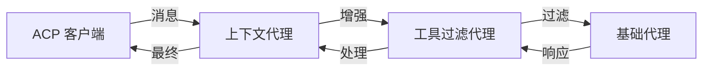

### 实践中的代理：conductor 的角色

为了允许代理隔离，我们的设计不让代理直接与链中的后继通信。相反，有一个中央 **conductor** 组件来协调组件之间的消息移动。

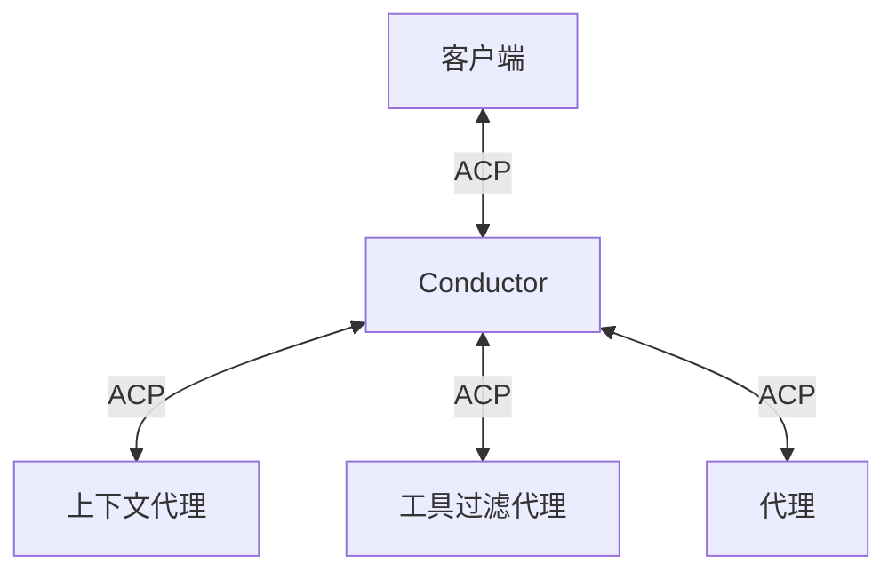

我们为代理通信添加了一个 ACP 方法：

- **`proxy/successor`**：双向使用——代理发送它以将消息转发给其后继，conductor 发送它以将来自后继的消息传递给代理

以下是单个消息如何流经系统：

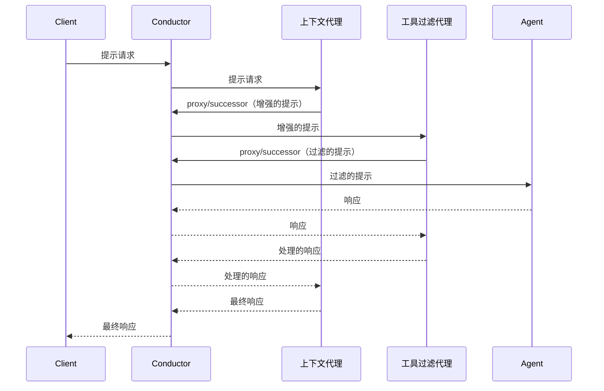

## 美好的未来

> 一旦这个功能存在，事情将如何发展？

### 用户体验和编辑器集成

我们期望编辑器以与当前支持添加 MCP 服务器相同的方式暴露安装代理的能力——实际上，对用户来说这种区别可能并不重要。两者都是"扩展"，为他们的 AI 工作流添加功能。

当安装代理时，编辑器不会直接启动代理，而是使用配置的代理链调用 conductor。从用户的角度来看，他们只是获得了增强的代理能力——代理链架构保持透明。

### 特定语言的代理生态系统

代理开发的整体性质意味着大部分"动作"发生在代理内部。我们希望扭转这一趋势，代理趋向于简单的代理循环，创意被推向更广泛的生态系统。

Symposium 项目是探索这个概念的一个例子，重点关注 Rust。这个想法是为 Rust 用户提供基于他们正在使用的依赖项的自动扩展集。这些扩展将被打包为使用 WebAssembly 以实现可移植性和沙盒化的 SACP 代理。

Symposium 旨在通过同时提供核心 Rust 工具和 Rust 库贡献自己的代理组件的框架，成为标准的"Rust ACP 体验"。

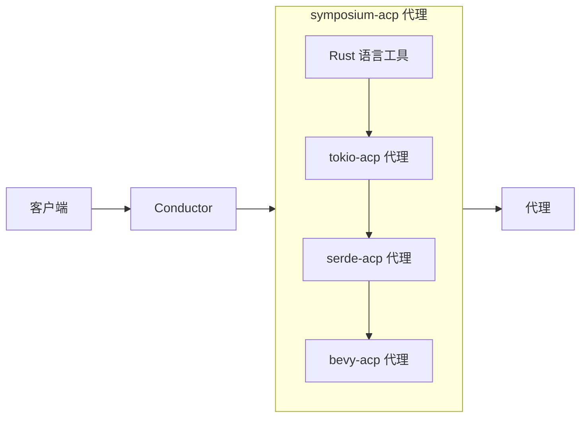

### 标准化的 IDE 能力

代理基础设施还可以使编辑器通过代理提供的 MCP 服务器向代理公开标准化的 IDE 功能（诊断、文件系统访问、终端 API）。这使核心 ACP 协议专注于代理通信，同时通过代理层允许丰富的 IDE 集成。

## 实施细节和计划

> 告诉我更多关于您的实施。您的详细实施计划是什么？

### 组件角色

每个 ACP 代理链形成一系列组件：

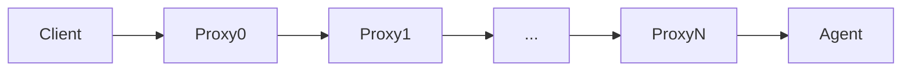

**客户端**和**代理**是**终端**角色——客户端只有一个后继（没有前驱），代理只有一个前驱（没有后继）。代理是**非终端**的——它们既有前驱也有后继，在它们之间转发消息。

**conductor** 是一个特殊的组件，用于协调代理链。它生成和管理代理组件，在它们之间路由消息，并处理初始化。从客户端的角度来看，conductor 看起来像一个普通的代理：

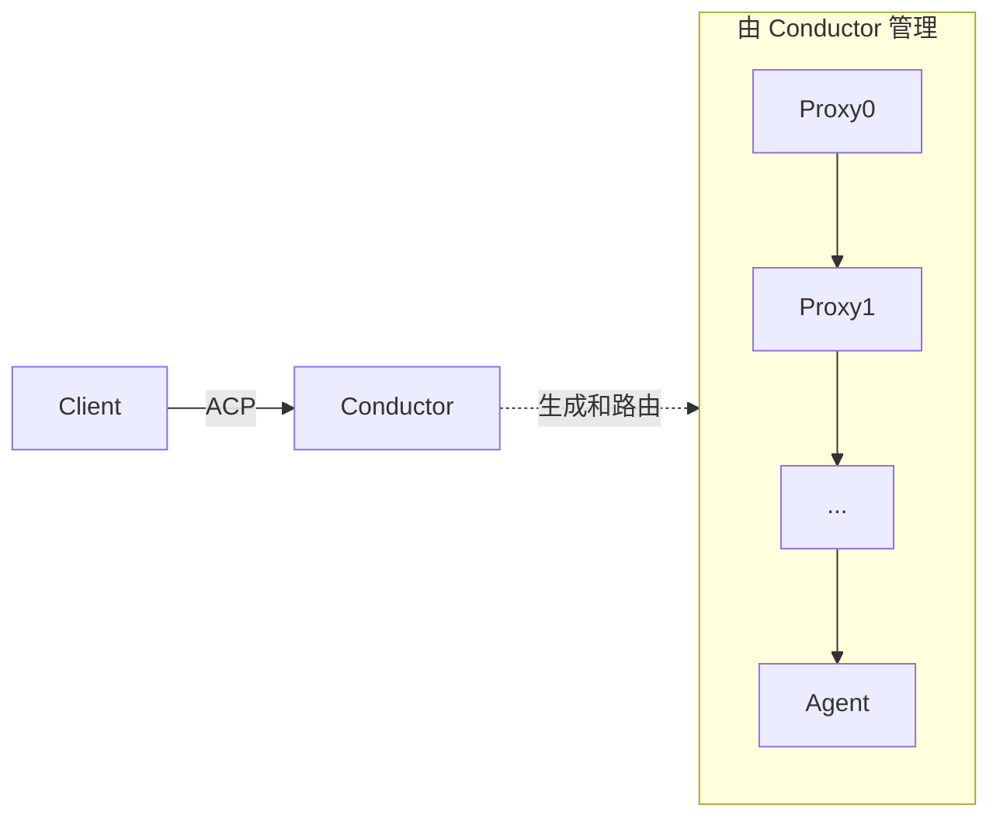

我们在 Rust 中提供了一个规范的 conductor 实现（`sacp-conductor`）。大多数编辑器会直接使用这个 conductor 来托管代理和代理，但它们也可以在需要时重新实现 conductor 功能。

ACP 将客户端和代理定义为超角色，每个都有两个专门化：

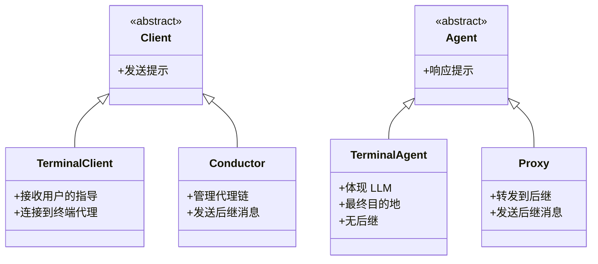

**示例架构：**

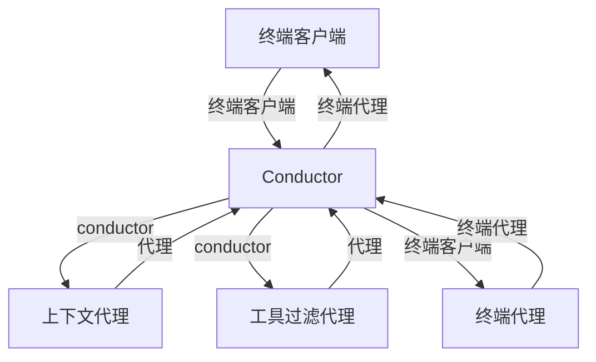

### 代理初始化协议

组件从它们收到的初始化方法中发现它们的角色：

- **代理**收到 `proxy/initialize`——它们有后继，应该转发消息
- **代理**收到 `initialize`——它们是终端的（没有后继），直接处理消息

`proxy/initialize` 请求具有与 `initialize` 相同的参数，并期望标准的 `InitializeResponse`。唯一的区别是方法名称，它向组件发出信号，表明它应该作为代理运行。

**Conductor 行为：**

- conductor 必须向所有代理组件发送 `proxy/initialize`
- conductor 必须向最终的代理组件发送 `initialize`（如果有）
- 当代理通过 `proxy/successor` 转发 `initialize` 时，conductor 确定后继是另一个代理还是代理，并分别发送 `proxy/initialize` 或 `initialize`

**代理行为：**

- 收到 `proxy/initialize` 的代理知道它有后继
- 代理应该转发它不理解的请求
- 代理在转发消息时应该保留元数据字段

注意：可以配置 conductor 以终端模式（期望 `initialize`）或代理模式（期望 `proxy/initialize`）运行，从而实现嵌套代理链。

### MCP-over-ACP 支持

提供 MCP 服务器的代理使用 [MCP-over-ACP 传输](./mcp-over-acp) 机制。conductor 始终向代理广告 `mcpCapabilities.acp: true`，并处理不支持原生 ACP 传输的代理的桥接。

所有代理必须响应 `proxy/initialize` 并启用 MCP-over-ACP 功能。当 conductor 发送 `proxy/initialize` 时，代理应该准备处理它们提供的任何 MCP 服务器的 `mcp/connect`、`mcp/message` 和 `mcp/disconnect` 消息。

### 消息参考

**初始化：**

```json
// Conductor 初始化一个代理（代理知道它有后继）
{"method": "proxy/initialize", "params": <INITIALIZE_REQUEST_PARAMS>}

// Conductor 初始化代理（标准 ACP）
{"method": "initialize", "params": <INITIALIZE_REQUEST_PARAMS>}
```

两种方法都使用与标准 ACP `InitializeRequest` 相同的参数，并期望标准的 `InitializeResponse`。

**代理消息：**

```json
// 代理发送消息给后继，或 conductor 发送来自后继的消息
//（相同的方法，方向由发送者决定）
{
  "method": "proxy/successor",
  "params": {
    "method": "<INNER_METHOD>",
    "params": <INNER_PARAMS>,
    "meta": { ... }            // 可选元数据
  }
}
```

内部消息字段（`method`、`params`）被展平到 params 对象中。包装的消息是请求还是通知由外部 JSON-RPC 信封中 `id` 字段的存在决定，遵循 JSON-RPC 约定。

### 示例（非规范）

以下序列图说明了常见的代理链场景以供实现者参考。

#### 4 组件代理链的初始化

这显示了以下内容的初始化流程：终端客户端 → Conductor → 上下文代理 → 工具过滤代理 → 终端代理

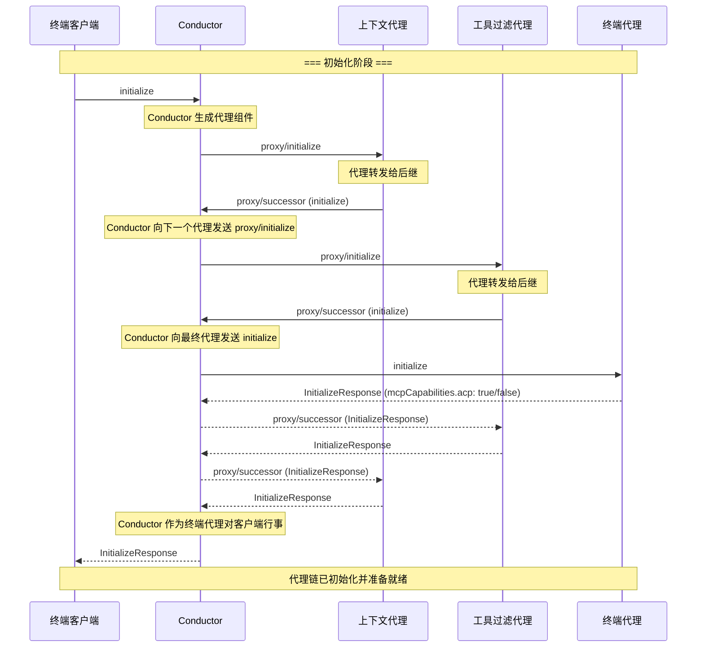

#### 提供上下文的代理与会话通知

这个示例显示了一个代理如何处理初始化并转发会话通知。Sparkle（一个协作 AI 框架）在会话创建期间运行一个化身序列。

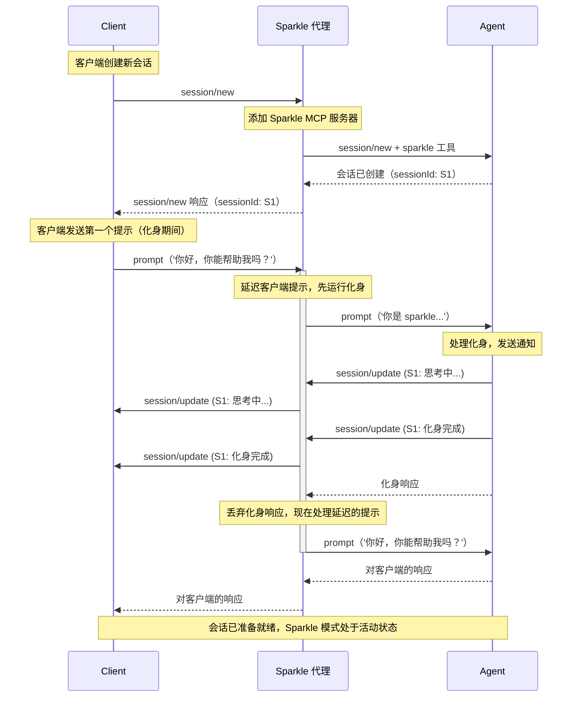

这演示了代理如何在会话创建期间运行初始化序列，同时透明地将所有会话通知转发回客户端。

## 常见问题

> 在编写本文档的过程中或随后的讨论中出现了哪些问题？

### 为什么使用单独的 `proxy/initialize` 方法而不是功能？

早期设计使用 `InitializeRequest` 中的 `"proxy": true` 功能，并要求代理在响应中回显它。这感觉有些笨拙，因为它不是真正的功能协商——它更像是"你必须作为代理运行"的指令。

使用不同的方法使契约更清晰：如果你收到 `proxy/initialize`，你就是一个有后继的代理；如果你收到 `initialize`，你就是终端代理。没有功能舞蹈，没有配置错误的风险，组件从方法名称立即知道它们的角色。

### 代理如何取代现有的代理扩展机制？

因为代理坐在客户端和代理之间，它们可以复制现有扩展机制的功能：

- **AGENTS.md 文件**：代理可以在提示到达代理之前将上下文和指令注入提示
- **Claude Code 插件/技能**：代理可以添加可用技能的上下文数据，并提供带有详细技能指令的 MCP 资源，这些指令在代理请求时按需提供
- **MCP 服务器**：代理可以通过 [MCP-over-ACP](./mcp-over-acp) 提供工具并处理工具回调
- **子代理**：代理可以通过启动新会话并协调多个代理实例来创建"子代理"
- **钩子和转向文件**：代理可以通过拦截请求和响应来修改对话流程
- **系统提示自定义**：代理可以在提示前预先添加消息或切换预定义的会话模式

关键优势在于基于代理的扩展可以与任何 ACP 兼容的代理一起工作，而不需要特定于代理的集成或修改。

### 代理如何与 MCP 服务器一起工作？

代理可以通过 [MCP-over-ACP 传输](./mcp-over-acp) 提供 MCP 服务器，使单个代理能够添加上下文、提供工具并在完全了解对话状态的情况下处理回调。

conductor 始终向代理广告 `mcpCapabilities.acp: true`，无论下游代理是否原生支持。当代理不支持 ACP 传输时，conductor 透明地处理桥接——生成代理正常连接的 stdio 垫片或 HTTP 服务器，然后中继消息到/from 代理的 ACP 通道。

这意味着代理作者不需要担心代理兼容性——他们实现 MCP-over-ACP，conductor 处理其余部分。

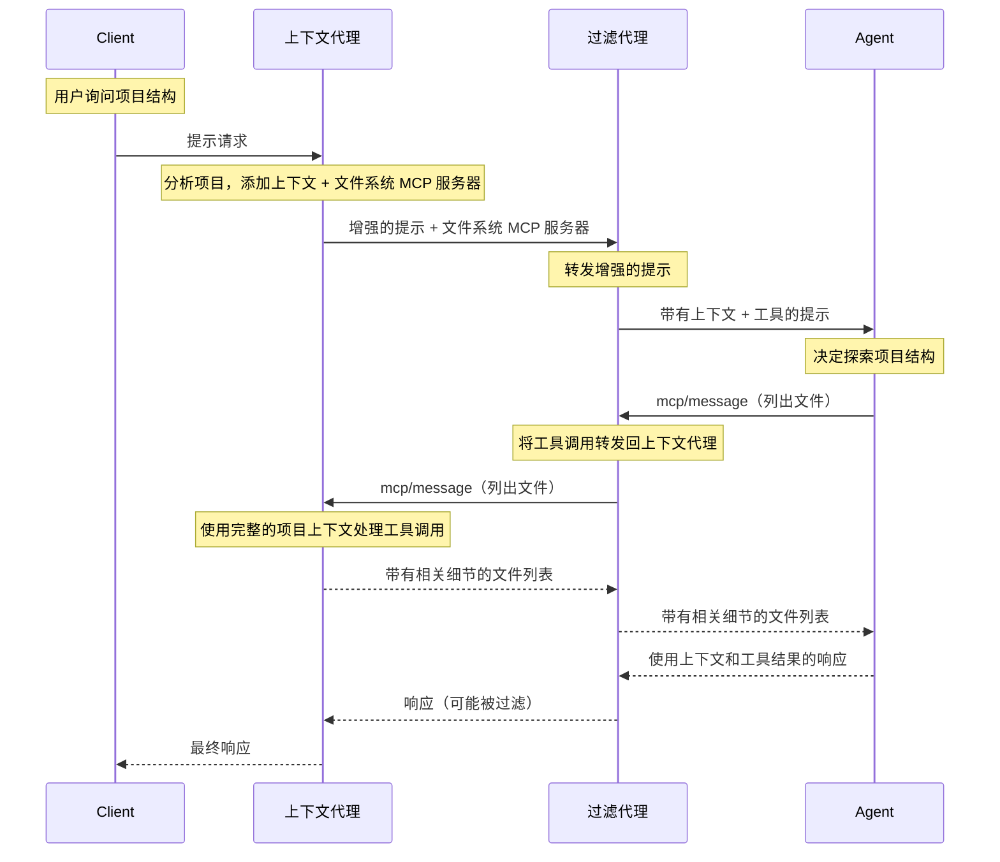

### 代理有什么限制吗？

是的，代理仅限于 ACP 协议本身可用的内容。它们可以拦截和转换任何 ACP 消息，但它们无法访问 ACP 不暴露的功能。

例如，代理无法直接修改代理的系统提示或上下文窗口——它们只能切换预定义的会话模式（可能影响系统提示）或预先将额外消息添加到提示。同样，代理无法访问内部代理状态、模型参数或其他未通过 ACP 消息暴露的实现细节。

这实际上是一个功能——它确保基于代理的扩展在不同代理实现之间保持可移植，并且不依赖于代理特定的内部结构。

### 为什么不在没有协议更改的情况下简单地级联 ACP 命令？

一种替代方案是让代理成为普通代理，内部创建和管理其后继。这可以工作（HTTP 代理以这种方式操作），但需要每个代理理解完整链并知道如何启动其后继。

这将代理耦合到传输机制、进程管理和链配置。更改传输、重新排序链或插入新代理需要修改前驱配置。

conductor 设计将代理与其后继解耦。代理发送消息"给后继"并从后继接收消息，而不知道后继是谁、如何启动或使用什么传输。这实现了：

- 更改传输协议或进程管理而无需重新编译代理
- 运输代理作为低能力 WASM 容器，只需要一个通信通道
- 通过配置而不是代码更改来重新排序、添加或删除代理

权衡是协议复杂性，但这种复杂性存在于 conductor 中（实现一次）而不是在代理实现中重复。

### 为什么所有消息都通过 conductor 而不是直接代理到代理通信？

即使使用 conductor，代理也可以在 conductor 设置连接后与其后继直接通信。通过 conductor 路由所有消息进一步将代理职责最小化到单个通信通道。

这支持将代理作为隔离的 WebAssembly 组件运行，功能最小。它还消除了冗余逻辑：如果没有 conductor 路由消息，每个代理需要管理与后继的连接。

conductor 处理进程管理、功能协商和消息路由，允许代理专注于转换逻辑。

### 标准 conductor 实现如何工作？

`sacp-conductor` 参考实现可以形成代理链的树。它可以配置为代理模式（期望 `proxy/initialize`）或终端模式（期望 `initialize`）。当其管理的链中的最后一个代理向其后继发送消息时，conductor 将该消息转发给它自己的父 conductor（如果在代理模式下）或转发给最终的代理（如果在终端模式下）。

这支持层次结构，例如：

```
client → conductor1 → final-agent
             ↓ 管理
         proxy-a → conductor2 → proxy-d
                      ↓ 管理
                  proxy-b → proxy-c
```

conductor 处理进程管理、功能协商和消息路由，但这些是实现细节——协议只指定消息格式和功能要求。

### 代理链有什么安全顾虑吗？

代理组件可以拦截和修改所有通信，因此信任至关重要——类似于安装任何软件。用户对他们选择运行的组件负责。

我们计划探索基于 WebAssembly 的代理，这将提供一些沙盒措施，但此类组件仍可能以未知或恶意的方式修改提示。

### 代理链的性能影响如何？

我们的架构确实引入了额外的消息传递——链中的每个代理在消息流过时都会增加额外的跳。然而，这些消息通常很小且开销很小，特别是与实际 LLM 推理的延迟相比。

对于包含大量数据的消息（大文件内容、广泛上下文），我们可能希望 conductor 集中存储该数据并引入一个"引用"机制，这样大多数代理就不必检查或复制大量有效负载，除非它们特别需要转换它们。

可组合性的好处通常超过人类节奏开发交互的最小延迟成本。

### 当代理组件崩溃或行为不端时会发生什么？

conductor 管理组件生命周期：

- 在可能的地方自动重启失败的组件
- 组件崩溃不会影响链的其余部分
- 通过绕过失败的组件实现优雅降级
- 清晰的错误报告以帮助用户调试配置问题

### 代理链可以嵌套或形成树吗？

是的！conductor 本身可以以代理模式运行，从而实现层次结构：

```
client → proxy1 → conductor（代理模式） → final-agent
                      ↓ 管理
                  p1 → p2 → p3
```

这支持复杂的组合，同时保持干净的接口。

### 代理链如何在将来支持多代理场景？

当前设计假设一个线性链，其中每个代理有一个单一的后继。为了支持 M:N 拓扑，其中代理与多个对等方通信（例如，将任务分派给多个专业代理的研究协调器），我们可以使用可选的 `peer` 字段扩展 `proxy/successor`：

```json
{
  "method": "proxy/successor",
  "params": {
    "method": "prompt",
    "params": { ... },
    "peer": "research-agent"
  }
}
```

当 `peer` 被省略时，消息转到默认后继（与当前线性链模型向后兼容）。当存在时，它指定消息 intended 的对等方。`proxy/initialize` 响应可以扩展以枚举可用的对等方，使代理能够发现和协调多个下游组件。

### 当前的实现状态如何？

此提案的原型版本已经实现，并在 crates.io 上作为以下 crate 提供：

- `sacp` -- 基础 ACP 协议 SDK
  - `sacp-tokio` -- 为 `tokio` 运行时添加特定工具
- `sacp-proxy` -- 实现代理的扩展
  - `sacp-rmcp` -- 为桥接到 rmcp crate 添加特定的代理扩展特征
- `sacp-conductor` -- 参考 conductor 实现

这些 crate 的规范源目前是 [symposium-dev/symposium-acp] 仓库。但是，副本已上游到 [agentclientprotocol/rust-sdk](https://github.com/agentclientprotocol/rust-sdk/tree/main/src/sacp-conductor) 仓库，并且如果此 RFD 被接受，那将成为规范主页。

## 修订历史

- 基于 symposium-acp 仓库中的工作实现初始草稿。
- 将 MCP-over-ACP 传输拆分为[单独的 RFD](./mcp-over-acp)以使任何 ACP 组件能够独立使用。