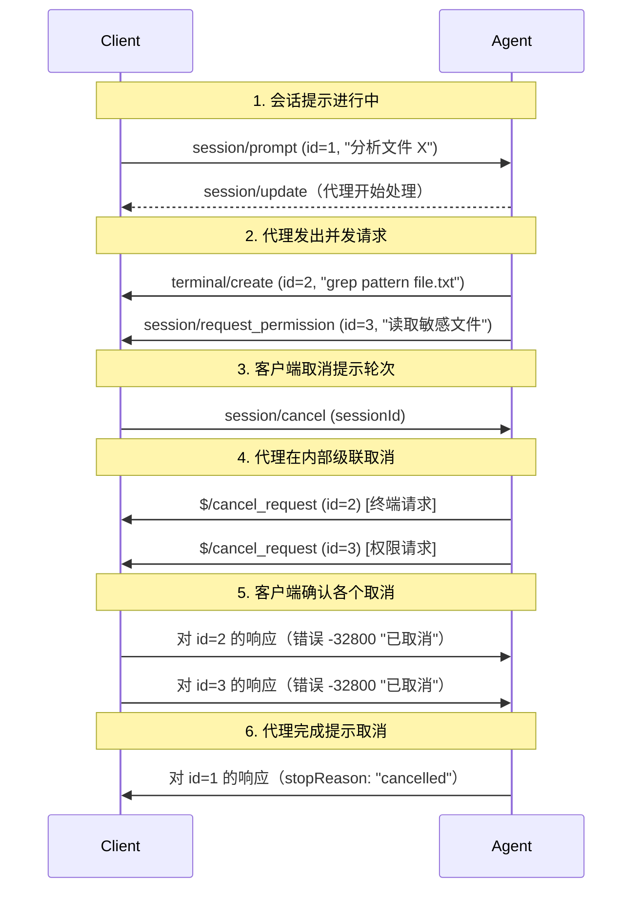

- 作者：[Artem Bukhonov](https://github.com/nerzhulart)
- 支持者：[@benbrandt](https://github.com/benbrandt)

## 电梯演讲

为代理客户端协议引入标准化的按请求取消机制，受 [语言服务器协议 (LSP)](https://microsoft.github.io/language-server-protocol/specifications/lsp/3.17/specification/#cancelRequest) 启发，以实现更细粒度的取消，其中单个 JSON-RPC 请求可以逐一取消。

## 现状

JSON-RPC 规范没有定义任何标准的请求取消机制，将其留给实现。目前，ACP 对特定功能有一些临时取消机制（如通过 `session/cancel` 取消提示轮次），但缺乏通用的、按请求的取消机制。

这造成了以下不便：

- 取消应该为每个功能单独处理
- 支持便捷取消机制的语言（C#、Kotlin 等）无法使用 ACP 底层机制实现通用的按请求取消，而应该手动调用按功能取消方法

## 我们提议对此做什么

实现一个**可选的** `$/cancel_request` 通知方法（受语言服务器协议启发）给代理和客户端，使用 JSON-RPC 2.0 通知格式，允许任何一方（客户端或代理）通过其 ID 取消任何未完成的请求。

该机制将是：

- **可选的**：并非所有实现都支持此功能，但建议支持。
- **灵活的**：提供两种取消时的响应选项：
  1. 带标准取消错误代码（-32800）的错误响应
  2. 带部分或取消数据的有效响应（当有意义的 parcial 结果存在时）

这种方法在灵活性与标准化之间取得平衡，允许实现选择加入取消支持，同时在启用时提供可预测的行为。

## 美好的未来

> 一旦这个功能存在，事情将如何发展？

实施后，这将启用：

- **SDK 集成层**：ACP SDK 可以自动连接到本地语言取消的默认机制（C# CancellationToken、Kotlin Job、Go context.Context、JavaScript AbortController 等）
- 单个 JSON-RPC 请求取消而不影响其他并发请求
- 当功能特定的取消方法不存在时的通用回退
- 来自外部 `$/cancel_request` 和内部取消触发器的一致取消行为
- 无论取消来源如何，标准错误响应（`-32800`）或部分结果

在未来的版本中，我们可能会弃用 `$/cancel_request` 通知，转而使用更通用的方法，因为它仍然提供相同的功能，但具有更大的灵活性和一致性。

## 实施细节和计划

### 协议更改

#### 取消方法

将 `$/cancel_request` 通知方法添加到 JSON-RPC 协议：

```typescript
interface CancelNotification {
  method: "$/cancel_request";
  params: {
    requestId: string | number; // 要取消的请求的 ID
  };
}
```

### 取消行为

任何一方都可以发送 `$/cancel_request` 来取消请求。以 '$/' 开头的通知方法是协议实现相关的消息，可能无法在所有客户端或代理中实现。例如，如果实现使用单线程同步编程语言，那么它对 `$/cancel_request` 通知几乎无能为力。如果代理或客户端收到以 '$/' 开头的通知，它可以自由地忽略该通知。

**接收方**：

- 对不支持的取消请求执行特殊处理
- 返回不支持的 `$/cancel_request` 通知的自定义错误

#### 取消处理

当支持实现收到 `$/cancel_request` 通知时，它：

- **必须**取消相应请求活动及其所有嵌套活动
- **可以**在响应之前完成发送任何待处理通知
- **必须**为原始请求发送以下响应之一：
  - 带适当数据（如部分结果或取消标记）的有效响应
  - 带代码 [`-32800`（请求已取消）](./schema#errorcode) 的错误响应

#### 内部取消

请求也可以由执行方在未收到 `$/cancel_request` 的情况下在内部取消：

- **客户端示例**：用户关闭 IDE、切换到不同的项目、文件变得不可用
- **代理示例**：达到 LLM 上下文限制、内部超时、资源限制

当发生内部取消时，执行方**应该**：

1. 发送与收到 `$/cancel_request` 时相同的 `-32800`（已取消）错误响应
2. 确保无论取消来源如何，行为都一致

### 错误代码

为取消的请求添加标准 JSON-RPC 错误代码 `-32800`：

- 代码：`-32800`
- 消息："请求已取消"
- 含义：方法的执行因调用者的取消请求或资源限制/关闭而中止

## 常见问题

> 在编写本文档的过程中或随后的讨论中出现了哪些问题？

### 您考虑了哪些替代方法，为什么选择这一个？

核心需求是添加**细粒度取消**作为单个 JSON-RPC 请求的通用机制，而**功能特定的取消方法**（如 `session/cancel`）对于需要额外领域语义的案例仍然有用。

我们选择**LSP 风格的 `$/cancel_request`**方法，因为：

- 作为**默认取消层**，SDK 实现可以轻松映射到本地语言取消机制
- 来自 LSP 生态系统的开发者熟悉的经过验证的模式
- 适用于所有 JSON-RPC 传输（HTTP、WebSocket、stdio、管道）
- 当功能特定的取消不存在时提供通用回退
- 补充而不是替换现有的功能特定方法

### 这与现有的取消机制（如 `session/cancel`）有什么关系？

`$/cancel_request` 机制与功能特定的取消是互补的：

- `$/cancel_request`：任何 JSON-RPC 请求的通用按 ID 取消
- `session/cancel`：具有额外语义的功能特定取消（例如，取消整个提示轮次上下文，触发特定的清理逻辑）

两种机制服务于不同的目的：

**功能特定方法**如 `session/cancel` 提供：

- 领域特定语义和行为
- 复杂操作的结构化清理
- 上下文感知的取消逻辑

**通用的 `$/cancel_request`**提供：

- 将编程语言取消机制（C# CancellationToken、Kotlin Job、Go context.Context 等）与 ACP 连接的默认取消层
- 当不存在功能特定方法时，任何请求的通用回退
- 便于 SDK 的简单基于 ID 的定位
- 标准化的错误响应

实现可以使用两者：功能特定方法用于丰富的语义，`$/cancel_request` 用于简单的按请求取消。

注意：在未来版本的协议中，`session/cancel` 可能被更通用的 `$/cancel_request` 取代。

#### 级联取消流示例



### 如果请求在取消处理之前完成怎么办？

如果请求在取消通知被处理之前正常完成，实现应该：

1. 发送正常响应（不是取消错误）
2. 忽略该请求 ID 的后续取消通知

这确保客户端始终收到有意义的响应并防止竞争条件。

### 实现应该如何处理级联取消？

当请求被取消时，实现应该：

1. 取消主要请求活动
2. 将取消传播到任何嵌套/子请求
3. 清理与整个请求树关联的资源
4. 为所有受影响的请求发送取消响应

这确保了完整的清理并防止资源泄漏。

## 修订历史

- 2025-11-13：从 PR #183 转换的初始版本
- 2025-12-05：更新为当前实现。
- 2025-12-09：镜像 LSP 行为。