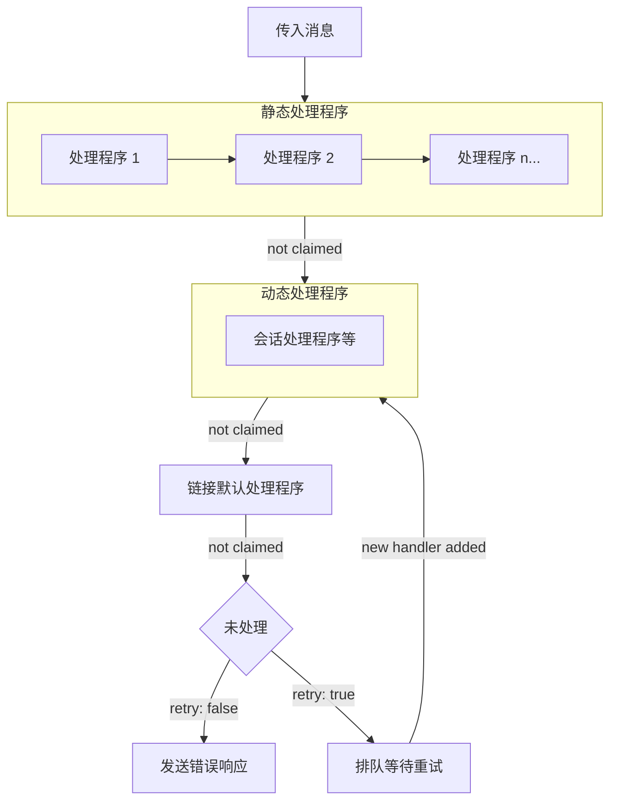

作者：[nikomatsakis](https://github.com/nikomatsakis)

## 电梯演讲

> 您提议进行什么更改？

用基于 SACP（Symposium ACP）的新实现替换当前的 ACP Rust SDK。新 SDK 提供基于组件的架构和构建器模式、明确的消息顺序保证，以及对 [代理链](./proxy-chains) 和 [MCP-over-ACP](./mcp-over-ACP) 的一等支持。

## 现状

> 今天的事情是如何运作的，这导致了什么问题？我们为什么要改变？

当前的 `agent-client-protocol` crate 具有直接的设计，具有用于常见 ACP 方法的基于特征的回调以及类型良好的请求和响应。对于简单目的来说很方便，但在尝试更复杂的设计时很快变得笨拙。

我们发现的两个达到设计极限的例子是 _conductor_（来自 [代理链](./proxy-chains) RFD）和 [patchwork-rs](https://patchwork-lang.github.io/patchwork-rs/) 项目：

Conductor 是一个编排器，在代理、代理和 MCP 服务器之间路由消息。它必须在消息流经系统时调整消息并保持正确的顺序。

Patchwork 是一个用于处理代理的程序化接口。它允许 Rust 程序运行提供自定义工具（使用 [MCP-over-ACP](./mcp-over-acp) 实现）和消息的提示：

```rust
let mut results = Vec::new();

let _: () = patchwork.think()
    .text("处理每个项目并使用 `record` 工具记录它")
    .tool(
        "record",
        "记录处理过的项目",
        async |input: RecordInput, _cx| {
            results.push(input.item);
            Ok(RecordOutput { success: true })
        },
        acp::tool_fn_mut!(),
    )
    .await?;

// 在 think 块之后，`results` 包含所有记录的项目
println!("Recorded: {:?}", results);
```

### 限制：处理程序无法发送消息

当前 SDK 使用像 `Agent` 这样的特征，处理程序方法只接收请求并只返回响应：

```rust
#[async_trait]
pub trait Agent {
    async fn prompt(&self, args: PromptRequest) -> Result<PromptResponse>;
    // ...
}
```

没有（简单的）方法在处理程序内部向客户端发送消息。如果你想在处理提示时发送 `SessionNotification`，你需要通过其他方式获得 `AgentSideConnection` 并自己协调访问。

这对于代理（在提示处理期间想要流式传输进度）是笨拙的，并且对于代理（需要在前驱处理请求时向其后继转发消息）是禁止的。

**目标：** 处理程序应该接收一个上下文参数，提供通过连接发送请求和通知的方法。

### 限制：固定的处理程序集

ACP 是一个可扩展协议，用户可以添加自己以 `_` 开头的 方法名称。当前 SDK 使用特征，这意味着它不能为用户定义的请求/通知提供"一流"支持。相反，这些使用扩展方法（`ext_method`、`ext_notification`）处理。这些方法没有静态类型，用户需要使用原始 JSON。

**目标：** 允许 SDK 用户定义自己的请求/通知类型，处理方式与内置类型相同。

### 限制：消息处理程序必须在所有会话中相同

当前 API 总是对特定方法执行相同的处理程序代码（例如，`session/update`）。如果特定会话需要不同的处理，该处理程序必须维护某种从 session-id 到所需处理的映射，这是不平凡的簿记，可能变得笨拙。作为这可能变得多复杂的一个例子，考虑旧版 patchwork 中使用的[ elaborate 消息转发方案](https://nikomatsakis.github.io/threadbare/agent.html#full-trace-nested-think)。

**目标：** 允许 SDK 用户添加/删除特定于特定会话或协议其他部分的"动态"处理程序。这些处理程序应该是闭包，因此它们可以捕获状态。

### 限制：没有顺序保证

在当前 SDK 中，每个传入的请求或通知都会在一个新生成的任务中处理。这意味着无法保证请求或通知按到达顺序处理。也无法确定通知是否在另一个请求的响应之前完全处理；例如，很难确定 `session/update` 通知是否在提示请求的响应发送之前被处理（作为轮次结束发送）。这对于 patchwork 等应用程序至关重要，它希望在返回之前完全捕获更新。

**目标：** 处理程序应该阻止消息处理，以允许它们在处理其他消息之前完全处理一条消息。

### 限制：令人困惑的命名和 1:1 假设

`AgentSideConnection` 是模糊的——这代表代理，还是到代理的连接？此外，SDK 当前假设每个连接有一个对等方，但 [代理](./proxy-chains) 可能希望向多个对等方（客户端或代理）发送/接收消息。这在 conductor 的早期版本中一直是困惑的根源，经常需要作者拿出铅笔和纸，非常仔细地思考事情。

**目标：** 使用方向性命名如 `ClientToAgent`，使关系明确："我是客户端，远程对等方是代理。"启用多个对等方。

### 限制：连接组件笨拙

在构建测试和其他应用程序时，能够创建客户端并直接连接到代理是很方便的，让框架处理管道。当前 SDK 只接受通道和字节流，这会产生不必要的样板文件。

**目标：** 提供一个 `Component` 特征，抽象任何可以通过 ACP 传输连接的东西，在编排场景中实现统一处理。

### 挑战：执行器独立性和无饥饿

这不是当前 SDK 的固有限制，而是我们想要解决的 Rust 异步设计中的常见陷阱。

我们希望 SDK 独立于特定执行器（不绑定到 tokio），同时仍然支持更丰富的模式，如生成后台任务。Rust 异步 API 的一个特定的常见问题是 _饥饿_，可能发生在流式 API 中，保持流式传输很重要以使项目取得进展。例如，在这样的设置中，"连接"在处理每个消息时没有被"等待"：

```rust
// 有问题的：消息处理在处理时饥饿
while let Some(message) = connection.next().await {
    process(message).await; // 在此等待期间连接是静止的！
}
```

通过仔细的设计，可以避免这些危害。最常见的方法是生成任务（然后将一个绑定到特定执行器）或使用"内部迭代"风格的 API，如 `for_each` 或 `run_until`：

```rust
// 正确：消息处理并发继续
connection.run_until(async |cx| {
    // 此代码运行时连接处理消息
    let response = cx.send_request(request).block_task().await?;
    process(response).await
}).await
```

**目标：** 提供设计时即无饥饿的 API，使得意外阻止消息处理变得困难。

## 我们提议对此做什么

> 您提议如何改善情况？

我们提议采用来自 [`sacp`](https://github.com/symposium-dev/symposium-acp/)（作为 [Symposium 项目](https://symposium.dev) 的一部分开发）的设计和实现作为 `agent-client-protocol` v1.0 的基础。`sacp` crate 将被导入此仓库并重命名：

| 当前 | 新名称 |
| ------------------- | ------------------------------------ |
| `sacp` | `agent-client-protocol` (v1.0) |
| `sacp-derive` | `agent-client-protocol-derive` |
| `sacp-tokio` | `agent-client-protocol-tokio` |
| `sacp-rmcp` | `agent-client-protocol-rmcp` |
| `sacp-conductor` | `agent-client-protocol-conductor` |
| `sacp-test` | `agent-client-protocol-test` |
| `sacp-tee` | `agent-client-protocol-tee` |
| `sacp-trace-viewer` | `agent-client-protocol-trace-viewer` |

然后 `sacp` crate 将被弃用以支持 `agent-client-protocol` 系列。新 SDK 通过基于构建器的 API 和显式连接语义解决了上述限制。

下表总结了关键 API 概念及其解决的目标：

| API 概念 | 解决的目标 |
| ----------------------------------------------------------------------------------- | ----------------------------------------- |
| [链接类型](#链接类型和方向性命名) (`ClientToAgent`, `AgentToClient`) | 令人困惑的命名，1:1 假设 |
| [`Component` 特征 + `connect_to`](#component-特征和-connect_to) | 连接组件笨拙 |
| [连接上下文 (`cx`)](#发送消息) | 处理程序无法发送消息 |
| [`on_receive_*` 处理程序](#处理消息) 带有闭包类型 | 固定的处理程序集 |
| [`serve` / `run_until`](#运行连接-serve-和-run_until) | 执行器独立性，无饥饿 |
| [会话构建器 + 动态处理程序](#会话构建器和-mcp-服务器) | 处理程序必须在所有会话中相同 |
| [顺序保证 + `spawn`](#控制顺序) | 没有顺序保证 |

我们通过实现多个用例验证了设计：

- **sacp-conductor**（将重命名为 **agent-client-protocol-conductor**）- [代理链](./proxy-chains) RFD 中 conductor 的实现
- [Patchwork](https://patchwork-lang.github.io/patchwork-rs/) - 程序化代理编排
- **elizacp** - 实现经典 ELIZA 程序的代理
- **agent-client-protocol-tee** - 在转发前记录消息的代理
- **yopo**（"你只提示一次"）- 用于单次提示的 CLI 工具

下面的[深入探讨](#深入探讨)部分详细介绍了每个概念。

## 深入探讨

本节详细介绍了 SDK 概念，按您想要做什么组织。

### 入门

#### 链接类型和方向性命名

SDK 围绕描述你是谁以及你在和谁交谈的 _链接类型_ 组织。最常见的两个例子是：

- `ClientToAgent` - "我是一个客户端，连接到一个代理"
- `AgentToClient` - "我是一个代理，服务于一个客户端"

从链接类型开始并调用 `builder` 方法来构建连接。构建器使用典型的"流畅"风格：

```rust
// 作为客户端连接到代理
ClientToAgent::builder()
    .name("my-client") // 可选，对追踪有用
```

```rust
// 作为代理服务客户端
AgentToClient::builder()
    .name("my-agent") // 可选，对追踪有用
```

SDK 中的大多数类型都参数化到链接类型。这有助于记录连接的意图，并确定在未注册事件处理程序时的默认方法处理。（`ClientToAgent` 和 `AgentToClient` 通常对未处理的消息报错，但代理默认为转发。）

#### `Component` 特征和 `connect_to`

`connect_to` 方法将你的构建器连接到另一端。参数可以是实现 `Component<Link>` 特征的任何东西，它抽象了任何可以通过 JSON-RPC 通信的东西：

```rust
// 通过 stdio 连接到代理
ClientToAgent::builder()
    .connect_to(acp::stdio())
```

`AcpAgent` 类型允许连接到外部 ACP 代理或代理扩展：

```rust
// 通过命令连接到特定代理
ClientToAgent::builder()
    .connect_to(AcpAgent::from_str("some-command --acp"))

// 连接到 Zed 的 Claude Code 集成
ClientToAgent::builder()
    .connect_to(AcpAgent::zed_claude_code())
```

对于测试，你可以直接将构建器相互连接——无需传输设置：

```rust
ClientToAgent::builder()
    .connect_to(AgentToClient::builder())
```

或者连接到实现 `Component` 的结构：

```rust
impl Component<AgentToClient> for MyAgent {
    async fn serve(self, client: impl Component<ClientToAgent>) -> Result<(), acp::Error> {
        AgentToClient::builder()
            .on_receive_request(/* ... */)
            .serve(client)
            .await
    }
}

// 客户端直接连接到代理——对测试有用
ClientToAgent::builder()
    .connect_to(MyAgent::new())
```

#### 运行连接：`serve` 和 `run_until`

`connect_to` 方法返回一个 `JrConnection`，但该连接在执行之前是惰性的。有两种方法可以运行它。

**`serve()`** 运行直到连接关闭。这适用于"响应"组件，响应传入消息：

```rust
AgentToClient::builder()
    .name("my-agent")
    .on_receive_request(/* ... */)
    .connect_to(transport)?
    .serve()
    .await
```

**`run_until()`** 获取一个异步闭包并与消息处理并发运行你的代码。闭包接收一个 _连接上下文_（惯例上称为 `cx`）——这是你与连接交互的方式，发送消息、生成任务和添加动态处理程序。当闭包返回时，连接关闭：

```rust
ClientToAgent::builder()
    .name("my-client")
    .connect_to(transport)?
    .run_until(async |cx| {
        // 你的代码在这里运行，而消息在后台处理。
        // 使用 `cx` 发送请求和通知。
        let response = cx.send_request(InitializeRequest::new(ProtocolVersion::LATEST))
            .block_task().await?;
        Ok(response)
    })
    .await
```

`run_until` 模式直接解决饥饿问题。它暴露一个用户可能意外阻止的异步流，而是 `run_until` 与消息处理并发运行你的代码。

`cx` 类型（`JrConnectionCx`）遵循"句柄"模式：克隆的值引用同一个连接。它是 `'static`，因此可以在线程之间发送或存储在结构中。注册的处理程序（使用 `on_receive_*`）也接收一个 `cx` 参数。

### 发送消息

#### 发送通知

使用 `cx.send_notification()` 发送通知。如果连接断开，它返回一个 `Result` 是 `ERR`：

```rust
cx.send_notification(StatusNotification::new("processing"))?;
```

#### 发送请求

使用 `cx.send_request()` 发送请求。这返回一个用于管理响应的句柄：

```rust
let response_handle = cx.send_request(PromptRequest::new(session_id, messages));
```

句柄不是响应本身——可能尚未到达。你有两个选项来获取它：

**`on_response` / `on_ok_response`** 注册一个在响应到达时运行的处理程序：

```rust
cx.send_request(PromptRequest::new(session_id, messages))
    .on_ok_response(
        async move |response: PromptResponse, cx| {
            println!("代理完成: {:?}", response.stop_reason);
            Ok(())
        },
        acp::on_response!()
    )?;
```

**`block_task`** 返回一个你可以等待的未来：

```rust
let response: PromptResponse = cx.send_request(PromptRequest::new(session_id, messages))
    .block_task()
    .await?;
```

`block_task` 方法在处理程序中很方便但很危险。请参阅[控制顺序](#控制顺序)了解详情。

### 控制顺序

#### 原子处理程序

处理程序方法（名称以 `on_` 开头的方法）按消息到达的顺序执行。每个处理程序必须在处理下一条消息之前完成：

```rust
.on_receive_request(async |req: PromptRequest, request_cx, cx| {
    // 在此运行期间不会处理其他消息
    cx.send_notification(StatusNotification::new("processing"))?;
    // 通知保证在响应之前发送
    request_cx.respond(PromptResponse::new(StopReason::EndTurn))
}, acp::on_receive_request!())
```

#### `block_task` 和死锁

在处理程序中使用 `block_task` 会产生死锁：处理程序等待响应，但响应在被处理程序返回之前无法被处理。

```rust
// 错误——会死锁
.on_receive_request(async |req: PromptRequest, request_cx, cx| {
    let response = cx.send_request(SomeOtherRequest::new())
        .block_task()  // 死锁！处理程序阻塞等待响应
        .await?;       // 但响应在被处理程序返回之前无法被处理
    request_cx.respond(/* ... */)
}, acp::on_receive_request!())
```

使用 `on_response` 代替，或生成一个任务。

#### 生成任务

使用 `cx.spawn` 与消息处理并发运行工作：

```rust
.on_receive_request(async |request: PromptRequest, request_cx, cx| {
    cx.spawn(async move {
        // 在这里使用 block_task 是安全的——我们在生成的任务中
        let response = cx.send_request(InitializeRequest::new(ProtocolVersion::LATEST))
            .block_task()
            .await?;
        /* ... */
        Ok(())
    })?;

    // 处理程序立即返回，生成的工作继续
    request_cx.respond(/* ... */)
}, acp::on_receive_request!())
```

生成的任务在 `JrConnectionCx` 中跟踪，不需要特定于运行时的生成。

### 客户端会话

当客户端发送 `NewSessionRequest` 时，代理通常需要设置会话特定状态：仅适用于此会话的处理程序、具有针对工作区定制的工具的 MCP 服务器，或在会话确认时运行的初始化逻辑。

#### 会话构建器

会话构建器 API 提供了用于配置会话的流畅接口。从 `cx.build_session()` 或 `cx.build_session_from()` 开始并链接配置方法：

```rust
cx.build_session("/path/to/workspace")
    .with_mcp_server(my_mcp_server)?    // 附加 MCP 服务器（见下文）
    // ... 其他配置
```

MCP 服务器提供代理可以调用的工具。我们将在下面的示例中展示如何定义它们。

#### 使用 `run_until` 运行会话

运行会话的主要方式是 `block_task().run_until()`。这个模式允许你的闭包从周围作用域捕获借用状态——不需要 `'static` 要求：

```rust
// 在 run_until 闭包内部（不是处理程序）
let workspace_path = Path::new("/my/workspace");

cx.build_session(workspace_path)
    .with_mcp_server(
        McpServer::builder("tools")
            .tool_fn("get_path", "返回路径", async move |_: (), _cx| {
                // 可以按引用捕获 `workspace_path`！
                Ok(workspace_path.display().to_string())
            }, acp::tool_fn!())
            .build()
    )?
    .block_task()
    .run_until(async |mut session| {
        session.send_prompt("工作区路径是什么？")?;
        let response = session.read_to_string().await?;
        println!("{response}");
        Ok(())
    })
    .await?;
```

`run_until` 闭包接收一个 `ActiveSession`，具有与代理交互的方法：

- **`send_prompt(text)`** - 向代理发送提示
- **`read_to_string()`** - 读取所有更新直到轮次结束，返回文本内容
- **`read_update()`** - 读取单个更新以进行细粒度控制

对于更复杂的 MCP 服务器，你可以通过 `agent-client-protocol-rmcp` crate 使用标准的 rmcp API：

```rust
use agent_client_protocol_rmcp::RmcpServer;

cx.build_session(workspace_path)
    .with_mcp_server(RmcpServer::new(my_rmcp_service))?
    // ...
```

#### 使用 `on_session_start` 的非阻塞会话

当你需要从 `on_receive_*` 处理程序内部启动会话但无法阻塞时，使用 `on_session_start`。这会生成会话工作并立即返回：

```rust
.on_receive_request(async |req: NewSessionRequest, request_cx, cx| {
    cx.build_session_from(req)
        .with_mcp_server(my_mcp_server)?
        .on_session_start(async |mut session| {
            session.send_prompt("Hello")?;
            let response = session.read_to_string().await?;
            Ok(())
        })?;

    // 处理程序立即返回，会话在后台运行
    Ok(())
}, acp::on_receive_request!())
```

请注意，`on_session_start` 需要 `'static`——闭包和 MCP 服务器不能从周围作用域借用。使用拥有的数据或 `Arc` 来共享状态。

#### `start_session` 和代理会话

对于想要避免 `run_until` 的向右漂移但仍然需要阻塞行为的情况，`start_session` 直接返回一个 `ActiveSession` 句柄：

```rust
let mut session = cx.build_session(workspace_path)
    .with_mcp_server(my_mcp_server)?
    .block_task()
    .start_session()
    .await?;

session.send_prompt("Hello")?;
let response = session.read_to_string().await?;
```

像 `on_session_start` 一样，这需要 `'static` 来处理闭包和 MCP 服务器。

对于想要注入 MCP 服务器但以其他方式转发所有消息的代理，使用 `start_session_proxy`：

```rust
.on_receive_request(async |req: NewSessionRequest, request_cx, cx| {
    let session_id = cx.build_session_from(req)
        .with_mcp_server(injected_tools)?
        .block_task()
        .start_session_proxy(request_cx)
        .await?;

    // 会话消息在客户端和代理之间自动代理
    Ok(())
}, acp::on_receive_request!())
```

### 处理消息

#### 通知处理程序

使用 `on_receive_notification` 注册处理程序。闭包的第一个参数类型决定它处理哪种通知类型：

```rust
AgentToClient::builder()
    .on_receive_notification(
        async |notif: SessionNotification, cx| {
            //        -------------------
            //        预期的通知类型
            println!("会话更新: {:?}", notif.update);
            Ok(())
        },
        acp::on_receive_notification!(), // <-- 需要技巧性的宏参数
    )
```

注意那个"技巧性的宏参数"。这是由于异步闭包的当前限制。一旦 [返回类型表示法](https://github.com/rust-lang/rfcs/pull/3654) 稳定并且 [issue #149407](https://github.com/rust-lang/rust/issues/149407) 被修复，它可以被移除。

#### 请求处理程序

请求处理程序接收一个额外的 `request_cx` 参数用于发送响应：

```rust
.on_receive_request(
    async |req: PromptRequest, request_cx, cx| {
        // 处理请求...
        cx.send_notification(StatusNotification::new("processing"))?;

        // 发送响应
        request_cx.respond(PromptResponse::new(StopReason::EndTurn))
    },
    acp::on_receive_request!(),
)
```

`request_cx` 是 `#[must_use]`——如果你忘记发送响应，编译器会警告你。它提供三种方法：

- **`respond(response)`** - 发送成功响应
- **`respond_with_error(error)`** - 发送错误响应
- **`respond_with_result(result)`** - 根据 `Result` 发送任一种

`request_cx` 是 `Send`，因此如果你需要异步响应，你可以将它移动到另一个任务或线程：

```rust
.on_receive_request(
    async |req: LongRunningRequest, request_cx, cx| {
        cx.spawn(async move {
            let result = do_expensive_work(&req).await;
            request_cx.respond_with_result(result)
        });
        Ok(())
    },
    acp::on_receive_request!(),
)
```

### 自定义消息类型

使用派生宏定义自定义通知和请求：

```rust
#[derive(Debug, Serialize, Deserialize, JsonSchema, JrNotification)]
#[notification(method = "_myapp/progress")]
struct ProgressNotification {
    percent: u32,
    message: String,
}

#[derive(Debug, Serialize, Deserialize, JsonSchema, JrRequest)]
#[request(method = "_myapp/compute", response = ComputeResponse)]
struct ComputeRequest {
    input: String,
}

#[derive(Debug, Serialize, Deserialize, JsonSchema)]
struct ComputeResponse {
    result: String,
}
```

自定义类型的工作方式与内置类型完全一样——不需要特殊的 `ext_notification` 路径：

```rust
ClientToAgent::builder()
    .on_receive_notification(
        async |notif: ProgressNotification, cx| {
            println!("进度: {}% - {}", notif.percent, notif.message);
            Ok(())
        },
        acp::on_receive_notification!()
    )
```

#### 通用消息处理程序

在类型化处理程序之前使用 `on_receive_message` 和 `MessageCx` 拦截任何传入消息（请求或通知）：

```rust
.on_receive_message(
    async |message: MessageCx, cx| {
        // 将所有消息转发到另一个线程进行处理
        message_sender.send(message)?;
        Ok(())
    },
    acp::on_receive_message!(),
)
```

`MessageCx` 对于转发、日志记录或你需要拦截消息以进行类型分发的其他场景很有用。

### 消息处理深度

#### 处理程序链

_消息处理程序_ 获取一条消息的所有权并处理它，或者返回（可能是修改的）副本以供下一个处理程序尝试。处理程序链接在一起——每个都有机会在传递之前声明消息。



**静态处理程序**在构建时通过 `.on_receive_request()` 等注册。它们按注册顺序尝试。

**动态处理程序**在运行时添加通过 `cx.add_dynamic_handler()`。它们对于子协议很有用，其中相关消息组通过某种 ID 标识。例如，会话消息都共享一个 `session_id`——可以为每个会话注册一个动态处理程序来处理其消息。

**链接默认处理程序**为未处理的消息提供后备行为。例如：

- **`ClientToAgent`** - 未处理的请求报错，忽略未处理的通知
- **`ProxyToConductor`** - 将未处理的消息转发到下一个组件

你只需要为你想要拦截的消息注册处理程序。

#### 消息处理程序

`JrMessageHandler` 特征定义了处理程序如何工作：

```rust
pub trait JrMessageHandler: Send {
    type Link: JrLink;

    async fn handle_message(
        &mut self,
        message: MessageCx,
        cx: JrConnectionCx<Self::Link>,
    ) -> Result<Handled<MessageCx>, Error>;
}
```

处理程序获取消息的所有权。如果它处理消息，返回 `Handled::Yes`。如果不，返回所有权通过 `Handled::No { message, retry }` 以便下一个处理程序可以尝试：

```rust
pub enum Handled<T> {
    Yes,
    No { message: T, retry: bool },
}
```

**`retry` 标志**：如果任何静态或动态处理程序返回 `retry: true`，并且没有处理程序最终声明消息，它会被排队并在添加每个新动态处理程序时提供给它。这解决了会话的竞争条件：会话的消息可能在会话的动态处理程序注册之前到达。

`ClientToAgent` 和 `AgentToClient` 的默认处理程序已经为带有无法识别的会话 ID 的会话消息设置了 `retry: true`，所以你通常不需要自己处理这个。

为方便起见，处理程序可以返回 `Ok(())`，这等同于 `Handled::Yes`。

处理程序也可以在传递之前修改消息：

```rust
.on_receive_request(async |mut req: EchoRequest, request_cx, cx| {
    req.text.push("modified".to_string());
    Ok(Handled::No {
        message: (req, request_cx),
        retry: false,
    })
}, acp::on_receive_request!())
```

#### 注册动态处理程序

在运行时注册动态处理程序以进行会话特定或协议特定的消息处理：

```rust
let registration = cx.add_dynamic_handler(MySessionHandler::new(session_id))?;
```

当 `registration` 被删除时，动态处理程序被移除。要无限期保持它，调用 `run_indefinitely()`：

```rust
registration.run_indefinitely();
```

#### 来自链接类型的默认处理

每个链接类型为未处理的消息定义默认处理。例如：

- **`ClientToAgent`** - 未处理的请求报错，未处理的通知被忽略
- **`ProxyToConductor`** - 将未处理的消息转发到下一个组件

你只需要为你想要拦截的消息注册处理程序。

#### 实现处理程序的 MatchMessage

当直接实现 `JrMessageHandler` 时，`MatchMessage` 提供了人体工程学的分派：

```rust
impl JrMessageHandler for MyHandler {
    type Link = AgentToClient;

    async fn handle_message(
        &mut self,
        message: MessageCx,
        cx: JrConnectionCx<Self::Link>,
    ) -> Result<Handled<MessageCx>, Error> {
        MatchMessage::new(message)
            .if_request(async |req: InitializeRequest, request_cx| {
                request_cx.respond(InitializeResponse::new(req.protocol_version))
            })
            .if_request(async |req: PromptRequest, request_cx| {
                request_cx.respond(PromptResponse::new(StopReason::EndTurn))
            })
            .if_notification(async |notif: SessionNotification| {
                log::info!("会话更新: {:?}", notif);
                Ok(())
            })
            .await
            .done()
    }
}
```